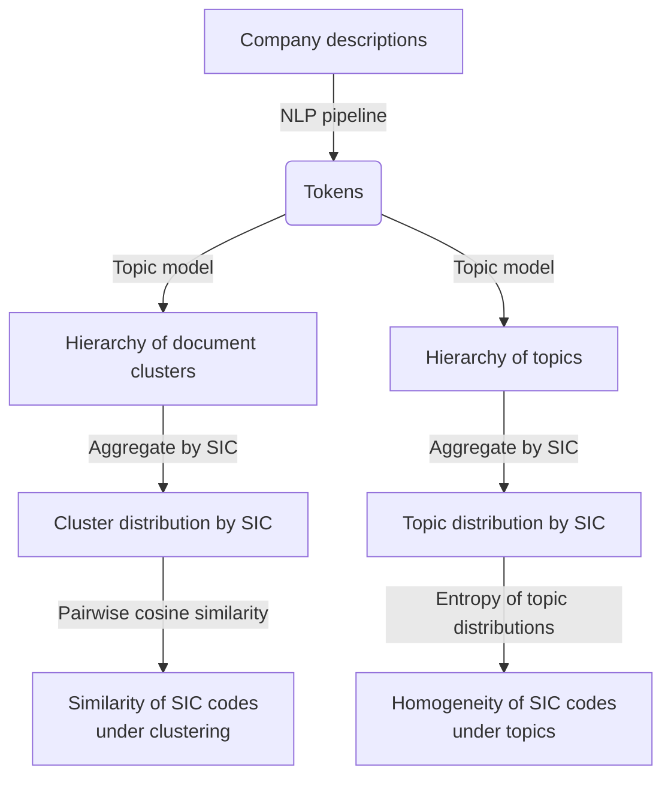

Runnable scripts.

## Topsbm

```mermaid
graph TD
    A[Company descriptions] -->|NLP pipeline| B(Tokens)


    B -->|Topic model| C[Hierarchy of document clusters]
    C -->|Aggregate by SIC| D[Cluster distribution by SIC]
    D -->|Pairwise cosine similarity| E[Similarity of SIC codes<br> under clustering]

    B -->|Topic model| F[Hierarchy of topics]
    F -->|Aggregate by SIC| G[Topic distribution by SIC]
    G -->|Entropy of topic distributions| H[Homogeneity of SIC codes<br> under topics]
```
