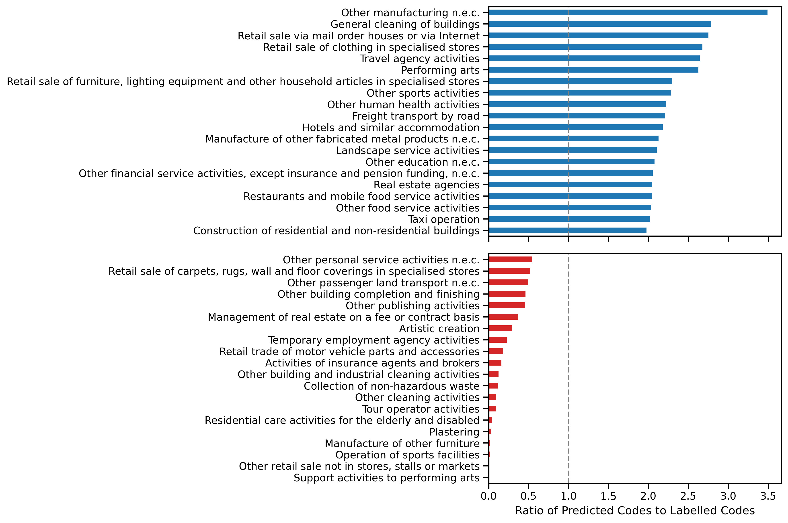
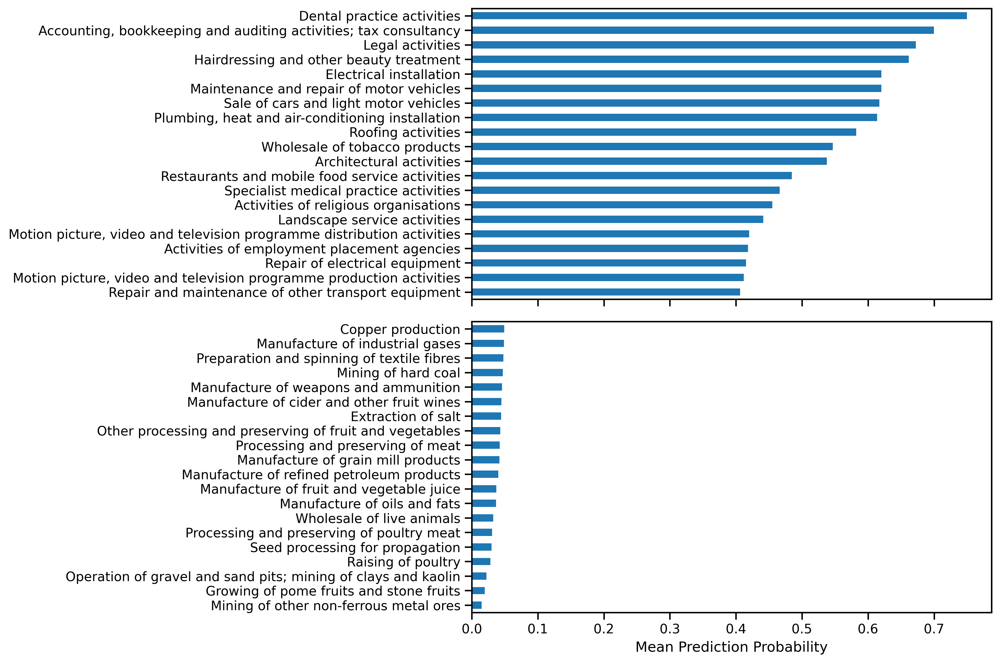
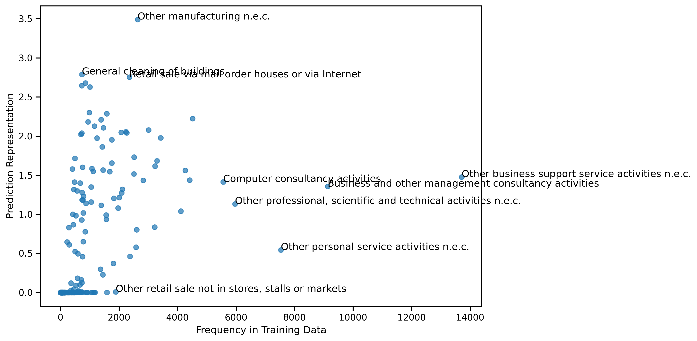
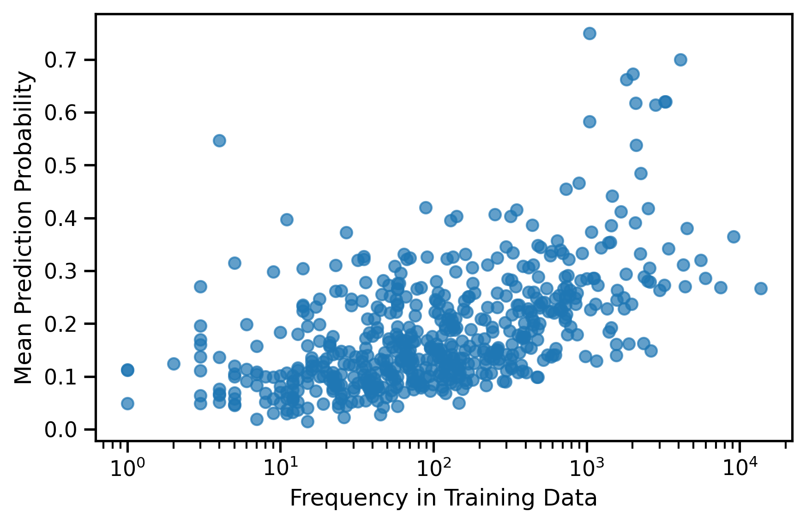

# 1. Summary

In this section we describe the construction of a classification model that is able to assign companies 4-digit SIC codes based on their business descriptions. This is used to highlight some of the challenges associated with categorising companies with single industrial activities. The steps in this process are:

1. Train a supervised text classification model based on company descriptions from Glass AI and SIC codes from Companies House.
2. Apply the model to a test set of company descriptions not used to build the model.

# 2. Methodology

The development of the classifier was treated as a supervised machine learning problem. In practice, there are no official datasets that contain company descriptions and their associated SIC codes. Therefore, we combined two sources of data to create our final training dataset. These are descriptions of companies obtained from their websites by Glass and the SIC code associated with each company from Companies House. These two datasets do not have innate fields that allow for direct joining therefore entries from Companies House were matched to their likely descriptions using a previously developed fuzzy matching approach. 

For the modelling itself, a transformer based approach has been taken. Transformers are a state-of-the-art neural network architecture that have shown to produce improved results on many language based machine learning tasks and have reduced the resources needed to create performant models. Importantly for this work, pre-trained models whose parameters have already been tuned on large volumes of text can be fine tuned for downstream tasks such as text classification. This can be done with relatively little data. It is this approach that we use here.

For the SIC code classifier, we fine-tuned an English language DistilBERT model. An additional classification layer was added to this neural network and it was trained on over 300,000 company descriptions and their labels. The model was then applied to 50,000 unseen business descriptions and the predictions were compared to the "ground truth" labels.

## 2. Results

Evaluating a classification model with 615 possible output classes is not a trivial task never an easy task as overall accuracy metrics often do not capture the differences and tradeoffs in precision and recall of the many classes. Specifically in this task there are additional complicating factors: 

1. The 4-digit SIC code labels in the training data are often not appropriate for the business description. It is unclear whether this is due to the fuzzy matching resulting in some mismatched data or poor labelling on Companies House. 
2. In some cases it is not possible to determine the purpose of the company from the website description provided by Glass AI. This might be because the text describes other attributes of the company such as its founding story, the description may be very short or the text may simply be website metadata.
3. The dataset is highly imbalanced. With a large number of classes it is already challenging to optimise accuracy for all possible labels and this is exacerbated by a heavy class imbalance. Some labels are represented tens of thousands of times in the training data, many others are present fewer than ten times.

Despite these limitations, there are useful insights that can be be gained from the outputs of the classifier and its predictions. In [@fig:predicted_sic4_representation_barh] we can see 20 predicted SIC codes that are overrepresented and 20 codes that are underrepresented compared to the actual codes associated with companies in the data. Only 95 of the 615 possible 4-digit SIC codes were produced by the classifier to label companies, suggesting that  while the classifier believes some codes are very widely applicable, there are many codes that are challenging for the classifier to identify from company descriptions.
 
{#fig: predicted_sic4_representation_barh}

For each company description, the classifier produces a vector of 4-digit SIC code probabilities. The code with the highest probability is chosen as the predicted label, however investigating those probabilities also yields useful insights as to the confidence of the classifier. We took all of the  probabilities for the successfully predicted labels and aggregated them by 4-digit SIC code to obtain the mean. In this way are able to see which codes are generally predicted with higher or lower probabilities. We can see from [@fig: mean_sic4_prediction_probability_barh] that the codes with higher prediction probabilities tend to be more widely known whereas the areas with lower probabilities describe more niche activities.

{#fig: mean_sic4_prediction_probability_barh}

While it might be reasonable to suspect that codes are overrepresented due to their frequency in the training data from which the classifier has learned, we see that this is not always the case. While there is a positive correlation between  the frequency of 4-digit SIC codes in the training data and their representation among predicted codes, the relationship is weak and not linear. There are a number of sectors that have a high relatively high frequency, but are underrepresented and vice-versa. The codes highlighted in [@fig:predicted_sic4_representation_vs_training_frequency_scatter] show that the extremes consist of quite highly generalised activity descriptions, suggesting that the model recognises them as catch-all labels or not sufficiently specific to be used in comparison to other labels.

{#fig:predicted_sic4_representation_vs_training_frequency_scatter}

There is also a relationship between the frequency of a code's appearance in the training data and its average prediction probability on the test set. The trend in [@fig:mean_sic4_prediction_probability_vs_training_frequency_scatter] shows that although there is a gradual trend with the log of a code's frequency, there are similarly codes with a low frequency that have a high average prediction probability.

{#fig:mean_sic4_prediction_probability_vs_training_frequency_scatter width=50%}

Finally, we assessed the coherence of the groups of company descriptions in our predicted categories using the silhouette score. This metric is normally reserved for assessing the quality of clusters when using an unsupervised machine learning method, however essentially it measures the extent to which points in a group are clustered with samples similar to themselves by looking at the inter-group and intra-group sample distances. A higher score means that points in a cluster are grouped tightly and are separated from other clusters. This corresponds to how similar the descriptions of companies are to each other within a group of companies with the same predicted 4-digit SIC code and how semantically separable they are from companies with different predicted codes.

We encoded the company descriptions as 768 dimensional vectors with a variant of the BERT transformer pre-trained specifically for semantic similarity calculations and calculated the silhouette score for each sample within a specific SIC code before finding the mean. The codes with the top and bottom average scores are shown in [@fig:predicted_sic4_silhouette_barh] suggesting that the descriptions of specific but ubiquitous industries tend to cluster better in the semantic space created.

{#fig:predicted_sic4_silhouette_barh}

# 3. Next Steps

There are two overarching goals from this point. The first is to improve the classifier through further cleaning of the training data and the second is to better establish the degree to which the labelling is limited by the existing SIC taxonomy.

## 3.1 Data Cleaning

As mentioned in the previous section, there are SIC codes that bear no resemblance to the company descriptions they accompany. This may be because of errors in the Glass AI data or because of the fuzzy matching process used to link that dataset with Companies House. In either case, we could improve the training data by removing samples where the 4-digit SIC code label has a very low semantic similarity with the company description. This would require establishing a threshold by manual inspection of the data.

## 3.2 Analysis of Predictions

The predictions produced by the model on a test dataset can be used to understand the limitations of the existing taxonomy by developing analyses that take advantage of company descriptions and try to track down the source of errors in the classifier. There are of course multiple ways of approaching this. Here we suggest further ways of measuring the quality of the predicted labels and approaches for identifying the causes of the model's decisions.

In some cases, one industrial code may not be sufficient to describe a company's activities. One analysis could be to identify where there are other possible labels that the model gave a high classification probability and to see how semantically similar that label is to the top label predicted. might have predicted. In cases where both labels have a high probability but a low semantic similarity, it may indicate that more than one label is required to adequately describe the organisation, and that possibly the company cuts across diverse industries.

Another could be to further explore the groups of companies in SIC code groups with a low silhouette score. This would help to identify whether there are groups of companies that are highly diverse in their activities but that business owners attempt to group under a single code.

Additionally we could investigate how far away predicted codes are in the SIC taxonomy from the labelled codes. This would involve calculating the distance required to traverse from one code to another across the taxonomy tree and would tell us how whether the company description captures activities from a different industrial sector to the one capture by the labelled code.

Once these further quantitative analyses have been carried out, we could take a more systematic approach to manually investigating the company descriptions and their predicted and labelled codes, particularly for codes or companies that lie at the extremes of the measures described in this report and for next steps. This would help elucidate the reasons behind the characteristics of companies that are very readily to classify and those that are more challenging, as well as the need for modifications to the taxonomy.