[An online version with interactive figures is available here.](https://industrial-taxonomy.s3.eu-west-2.amazonaws.com/output/topsbm_clusters.html)

# Summary

We process a subset (100K) of glass descriptions
 with two different pipelines ([@sec:preproc]);
 train a TopSBM [@topSBM] topic model ([@sec:topsbm]) on each; and pick the most promising looking pipeline.
 
We combine the document clusters output by the topic model
 and the SIC labels of the glass descriptions 
 (that have previously been obtained via. fuzzy matching to Companies House)
 to calculate the cosine similarity between SIC divisions
 (2-digit level of SIC codes).

We combine the topics output by the topic model
 and the SIC labels of the glass descriptions
 (that have previously been obtained via. fuzzy matching to Companies House)
 to measure the heterogeneity of SIC codes
 by calculating the entropy of the topic distributions for each sector.

# Data

The data used is the subset of glass descriptions 
 that are matched to Companies House
 with a match threshold of 60 or higher.

We sort these by match score 
 and choose the 100K best matches.

The reason for using a small subset of the data
 is due to the inability of TopSBM
 to scale to large corpuses.


# Pre-processing pipeline {#sec:preproc}

To convert the raw description text
 into the "bag of words" representation 
 required by topic models,
 I built two different pipelines.
The first was essentially the same process that has been used by Innovation Mapping team in previous projects.
The second uses `spacy`
 in order to hand off complexity to
 a standardised well-tested industrial-strength NLP library.
Furthermore, we can take advantage on the advanced capabilities of Spacy such as named entity recognition.

The pipelines are two branches of the same metaflow contained in `flows/glass_desc_preproc/glass_desc_preproc.py`.

## Hand-rolled Pipeline {#sec:simple}

This section details the steps taken by the first pipeline.

### Tokenisation

Tokens are identified
 using a regular expression
 that aims to capture the following 
 (in order of priority)
 as tokens:

- URL's
- Twitter-like @ identifiers, e.g. `@word` 
- XML 
- Words with an apostrophised suffix stripped
- A regular expression "word"

### Token conversion

Maps each token 
 to lower-case
 and replaces hyphenations with underscores.

### Token filtering

Filters out:
 URL's,
 twitter-like identifiers,
 XML,
 tokens without at least one ascii letter.

### Statistical filtering 1 

Filter out low frequency words (those occurring less than 10 times).

This stage is primarily done for optimisation in order to avoid the number of possible n-grams exploding in the next-step.

### N-gramming

Use `gensim` to generate bi-grams, requiring that a bigram occurs at least twice and that the normalise pointwise mutual information (NPMI)[^NPMI] is 0.25 or higher.

[^NPMI]: NPMI $\in [-1, 1]$ where a value of: -1 indicates tokens never occur together; 0 indicates independence; and 1 indicates complete co-occurrence.

### Lemmatisation

Tokens are lemmatised with the WordNet lemmatiser.

### Token filtering

Filters out:
 short tokens (2 or fewer characters),
 stopwords (including bi-grams that are both stopwords)

### Statistical filtering 2

Filter out low and high frequency words (those occurring less than 10 times and in more than 90% of documents).

One could argue that if stopword filtering was performing before the first statistical filtering then this step would be unnecessary.
The only difference would be that we would not have bi-grams that include a stop-word which are likely of limited worth. 


## Spacy Pipeline {#sec:spacy}

This section details the steps taken by the second pipeline.

The spacy model `en_core_web_lg` is used.

### Tokenisation

Handled by the spacy defaults.

### Named entity recognition

Spacy performs [named entity recognition](https://spacy.io/api/entityrecognizer) and merges series of tokens it predicts as entities into a single object.

### Token filtering

Tokens that are stopwords, punctuation, or whitespace characters are filtered out.

### Token lemmatisation/remapping {#sec:remapping}

Tokens that are entities in the following categories are renamed to correspond to their entity category (uppercased):

 - CARDINAL
 - DATE
 - GPE
 - LOC
 - MONEY
 - NORP
 - ORDINAL
 - ORG
 - PERCENT
 - PERSON
 - QUANTITY
 - TIME

I hypothesised that replacing these entities with their entity type name helps keep more information in the bag of words representation, particularly when entity types can be formed into n-grams with other words. 
The alternative is that individual dates, people, organisation names etc. are too infrequent in the corpus to contribute information to the topic modelling approach.

Several entity categories such as `WORK_OF_ART`, `LANGUAGE`, `LAW`, `EVENT` were excluded as an empirical assessment of the classifications appeared in accurate.
Furthermore, `PRODUCT` was left out because in this problem context (generating an industrial taxonomy) this is valuable information that we do not wish to homogenise.

Tokens that are not entities are replaced with their lowercase lemmatised form.

### Statistical filtering 1 

Filter out low and high frequency words (those occurring less than 10 times and in more than 90% of documents).

This stage is primarily done for optimisation in order to avoid the number of possible n-grams exploding in the next-step.

### N-gramming

Use `gensim` to generate bi-grams, requiring that a bigram occurs at least 10 times and that the normalise pointwise mutual information (NPMI)[^NPMI] is 0.25 or higher.

## Most notable differences

- Tokenisation performed with spacy defaults instead of hand-rolled regular expressions
- Named entity recognition performed by the spacy pipeline, and used to replace many entities with their entity type instead of the actual tokens.
- Stopword filtering is performed before n-gramming in the spacy pipeline.
- Lemmatisation and stopwords handled by spacy vs. NLTK
- Spacy pipeline is slower due to using advanced features such as NER (but can be trivially parallelised provided enough RAM is available)

## Conclusions

The spacy model pipeline appears to be the superior pick due to:

- Easy to implement advanced features
- Better model fit via. MDL measure ([@sec:topsbm])
- Potentially more informative topics ([@sec:topsbm])
- Document clusters relate to the SIC taxonomy more intuitively, seeming to pick up more nuanced connections than the simpler model. ([@sec:similarities])

# TopSBM pipeline {#sec:topsbm}

We train a TopSBM [@topSBM] topic model
 on our pre-processed collection of business descriptions.
This approach confers multiple advantages over the more traditional Latent Dirichlet Allocation (LDA) [@LDA] frequently used in the literature such as automatically selecting the number of topics; yielding a hierarchy of topics; permitting a more heterogeneous topic mixture than is permitted by LDA; and, crucially for the analysis of [@sec:similarities] generating document clusters.

## Implementation

TopSBM is run for each pipeline by running `flows/topsbm/run_v1.py` and `flows/topsbm/run_v2.py` respectively.
These scripts hand off to `research_daps@24_topsbm` (which will be merged soon) by feeding their tokenised documents (as a JSON file) to a metaflow that runs on an AWS EC2 instance with 64GB RAM (configurable) using a docker container that has graph-tool pre-installed.

<!-- Results from `notebooks/topsbm_explore.py`. -->

## Model fit and hierarchy

| Model   |   Level |   Number of topics | Number of clusters |
|:--------|--------:|-----------:|-------------:|
| simple  |       0 |        507 |          375 |
| spacy   |       0 |        348 |          301 |
| simple  |       1 |         95 |           79 |
| spacy   |       1 |         68 |           54 |
| simple  |       2 |         18 |           14 |
| spacy   |       2 |         10 |           10 |
| simple  |       3 |          3 |            2 |
| spacy   |       3 |          3 |            3 |
: Number of topics and number of document clusters for each TopSBM model's top 4 levels of its hierarchy {#tbl:hierarchy}

| Model | $log(MDL)$ |
| ---- | ---- |
| Simple | 17.07 |
| Spacy | 16.80 |
: Log of the minimum description length (MDL) of each topic model - lower is better. {#tbl:mdl}

[@tbl:mdl] shows that the spacy model has a better fit than the simple model.
This is likely due to the fact that the spacy model has fewer topics and clusters than the simple model given that the MDL measures the amount of information required to describe the data with the model.
While the raw input data to the pipline are identical, the the simple and spacy pipelines produce different bag of words representations that are fed into TopSBM.
The spacy model simplifies certain entity tokens into ([@sec:remapping]) its uppercased entity type resulting in a "smaller" input dataset which may contribute towards the differences in the models.

## Topics

| Topic 0   | Topic 1   | Topic 2   | Topic 3   | Topic 4     | Topic 5      | Topic 6     | Topic 7     | Topic 8      | Topic 9      | Topic 10   | Topic 11   | Topic 12     | Topic 13   | Topic 14      | Topic 15     | Topic 16      | Topic 17   |
|:----------|:----------|:----------|:----------|:------------|:-------------|:------------|:------------|:-------------|:-------------|:-----------|:-----------|:-------------|:-----------|:--------------|:-------------|:--------------|:-----------|
| day       | work      | event     | home      | school      | quality      | service     | experience  | vehicle      | team         | used       | care       | project      | equipment  | product       | installation | your_business | food       |
| community | year      | club      | family    | child       | client       | business    | area        | car          | people       | marketing  | health     | building     | delivery   | design        | repair       | information   | treatment  |
| life      | need      | travel    | centre    | course      | our_clients  | company     | local       | choice       | training     | shop       | practice   | property     | material   | customer      | your_home    | investment    | patient    |
| great     | new       | music     | site      | programme   | industry     | solution    | process     | selection_of | development  | range      | safety     | commercial   | part       | our_customers | cleaning     | firm          | restaurant |
| member    | support   | art       | house     | activity    | range_of     | system      | london      | are_looking  | management   | production | security   | construction | garden     | market        | domestic     | consultancy   | farm       |
| trust     | also      | play      | modern    | learning    | professional | technology  | unique      | sure         | staff        | creative   | safe       | build        | kitchen    | supply        | door         | agency        | beauty     |
| enjoy     | time      | holiday   | private   | education   | we_offer     | the_company | environment | contact_us   | organisation | research   | insurance  | planning     | workshop   | price         | residential  | software      | natural    |
| love      | the_best  | venue     | room      | student     | provide      | advice      | find        | van          | individual   | website    | control    | public       | hire       | sale          | window       | consultant    | clinic     |
| charity   | offer     | party     | visit     | church      | to_provide   | office      | facility    | driver       | skill        | global     | energy     | corporate    | furniture  | brand         | electrical   | financial     | dog        |
| live      | including | game      | space     | opportunity | providing    | sector      | cost        | make_sure    | we_work      | medium     | policy     | scheme       | item       | supplier      | clean        | network       | menu       |
: Simple models top 10 words for each topic at level 2 of the hierarchy {#tbl:topwords-simple}

| Topic 0   | Topic 1      | Topic 2      | Topic 3       | Topic 4     | Topic 5   | Topic 6    | Topic 7    | Topic 8      | Topic 9     |
|:----------|:-------------|:-------------|:--------------|:------------|:----------|:-----------|:-----------|:-------------|:------------|
| child     | GPE_GPE      | provide      | home          | service     | ORG       | vehicle    | building   | customer     | network     |
| school    | LOC          | client       | local         | business    | DATE      | car        | garden     | product      | financial   |
| community | people       | help         | event         | company     | GPE       | delivery   | clean      | supply       | agency      |
| course    | NORP         | team         | site          | project     | work      | stock      | cleaning   | market       | marketing   |
| learn     | staff        | support      | family        | industry    | PERSON    | shop       | kitchen    | equipment    | software    |
| student   | care         | experience   | PERSON_PERSON | solution    | offer     | item       | furniture  | brand        | insurance   |
| treatment | large        | range        | house         | system      | need      | hire       | energy     | job          | datum       |
| charity   | member       | quality      | produce       | property    | CARDINAL  | selection  | door       | installation | recruitment |
| patient   | want         | area         | facility      | development | include   | store      | electrical | supplier     | legal       |
| education | organisation | professional | serve         | require     | time      | collection | water      | repair       | finance     |
: Spacy models top 10 words for each topic at level 2 of the hierarchy {#tbl:topwords-spacy}

Given the simple model has near twice as many topics at level 2 as the spacy model, and lower levels have so many topics, it is hard to compare the quality of the topics.


# SIC similarities {#sec:similarities}

### Level 0


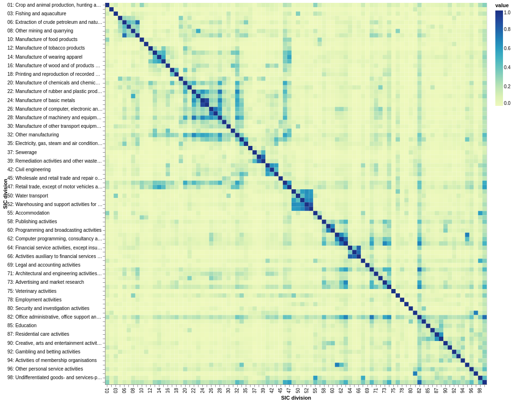{#fig:simple-L0 .altair}

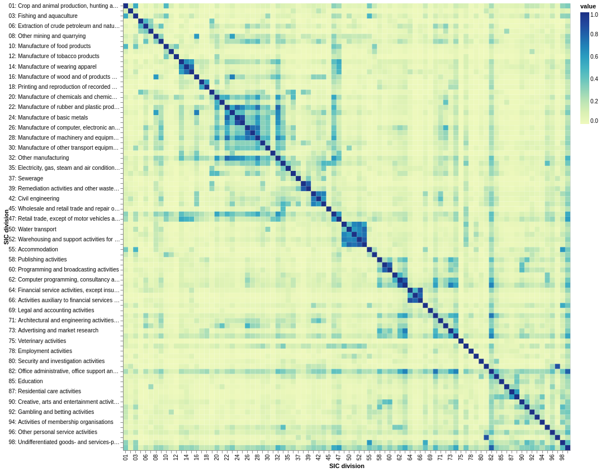{#fig:spacy-L0 .altair}

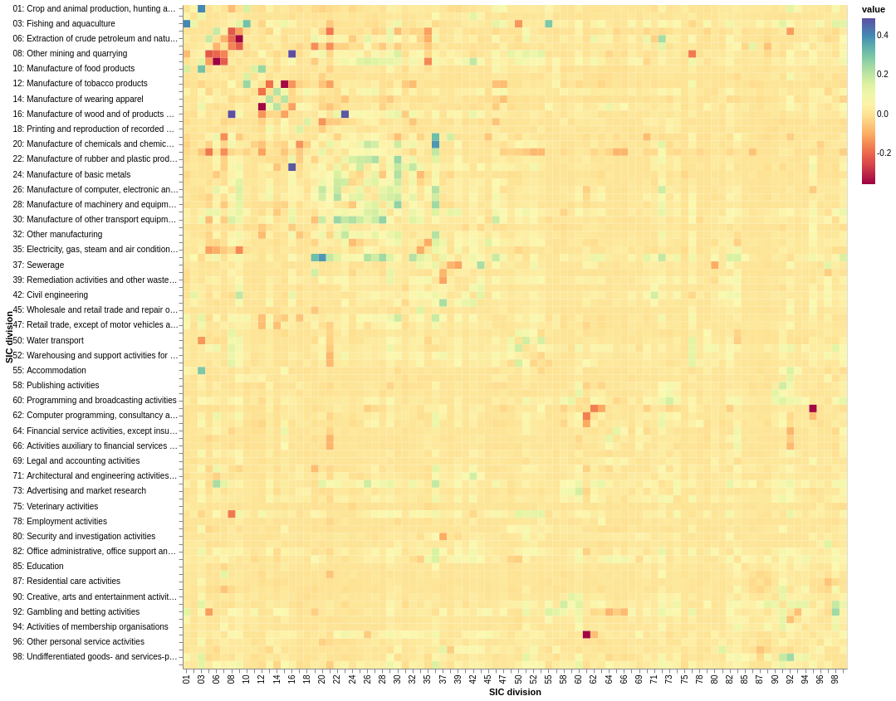{#fig:diff-L0 .altair}

At the most granular level of the cluster hierarchy, both pipelines produce broadly similar results.

Within section structure:

- Section A (Agriculture, Forestry and Fishing)
  - Low similarity except between 01 (Crop and animal production...) and 03 (Fishing...) in spacy model
- Section B: Mining and Quarrying
  - Block structure evident
  - Finer structure of similarity within section differs between models except between 06 (Extraction of petrol and gas) and 09 (Mining support service activities)
- Section C: Manufacturing
  - As a large section there are several sub-blocks evident
  - 32 (Other manufacturing) shares modestly high similarity across the full section
  - 13-15,31 (relating to textiles, clothes, and furniture) have obvious cohesive block structure
  - 10-12 (food, drink, tobacco) have some structure under the spacy model; however food is seen as more similar to tobacco than to drink!
  - 20,22-30,32-33 share a relatively cohesive block
  - 21 (Pharma manufacturing) is only similar to 21 (manufacture of chemicals) and 32 (other manufacturing)
- Section E: WATER SUPPLY; SEWERAGE, WASTE MANAGEMENT AND REMEDIATION ACTIVITIES
  - Weak block structure
  - 36 (water collection) less similar to other divisions
- Section F: CONSTRUCTION
  - Very strong block structure captured
- Section G: WHOLESALE AND RETAIL TRADE; REPAIR OF MOTOR VEHICLES AND MOTORCYCLES
  - 46 (wholesale trade) and 47 (retail trade) very similar
  - 45 (wholesale trade and retail trade of motor vehicles) distinct from 46 and 47
- Section H: TRANSPORTATION AND STORAGE
  - Very strong block structure across section
- Section I: ACCOMMODATION AND FOOD SERVICE ACTIVITIES
  - Very strong block structure across section
- Section J: INFORMATION AND COMMUNICATION
  - Obvious mixed block structure
  - Telecomms (61), IT services (63), and computer programming (62) cluster strongly together
  - 59 and 60 cluster together
- Section K: FINANCIAL AND INSURANCE ACTIVITIES
  - Strong clustering
- Section M: PROFESSIONAL, SCIENTIFIC AND TECHNICAL ACTIVITIES
  - 70 (Head offices / management consultancy) and 74 (Other activities) are highly similarly to other divisions within the section but otherwise similarity is low
- Section N: ADMINISTRATIVE AND SUPPORT SERVICE ACTIVITIES
  - Little block structure evident, 82 (Office admin/support) is moderately similar to other divisions within the section but no other division is similar to another
- Section Q: HUMAN HEALTH AND SOCIAL WORK ACTIVITIES
  - Strong clustering
- Section R: ARTS, ENTERTAINMENT AND RECREATION
  - Some divisions show similarity but block structure is weak (particularly under the simple model)
- Section S: OTHER SERVICE ACTIVITIES
  - Very weak similarity. Expected as divisions within this section are not obviously related.
- Section T: ACTIVITIES OF HOUSEHOLDS AS EMPLOYERS; UNDIFFERENTIATED GOODS- AND SERVICES-PRODUCING ACTIVITIES OF HOUSEHOLDS FOR OWN USE
  - Very weak similarity between the two divisions

Selection of interesting cross-section relationships:

- 01 (Crop and animal production, hunting...) and 03 (Fishing...) are highly related to 55 (Accomodation) and to a lesser extent 56 (Food and beverage services)
- Mining and quarrying are weakly similar to various Manufacturing activities, in particular 08 (Other mining/quarrying) is highly similar to 23 (Manufacture non-metallic minerals)
- Manufacturing section is similar to 46 and 47 (wholesale and retail trade)
- Section J (ICT) and Section M (Professional, Scientific, Technical activities) share high similarity
- 77 (Rental and leasing) is similar to divisions in sections G (trade) and H (Transport and storage). This is more strongly picked up by the spacy model.
- 82 (Office support/admin) is similar to many divisions across all sections
- Divison 99 which includes unclassified organisations as well as extraterritorial organisations and bodies has high simiarities to 82 (Office admin/support), 74 (Other Professional, Scientific, technical) activities, 46 and 47 (trade), 32 (other manufacturing) and others. Similarities here could be an indication about what types of businesses are misclassified.

### Level 1

Level 1 shows a stronger structure than that of level 0.
Furthermore, the two models begin to exhibit different behaviour from one another.

Some examples of extra structure that is revealed:

- Particularly under the spacy model, 45 (motor vehicle trade) is highly similar to section H (transportation and storage).
- Under the spacy model Section L (Real estate) is highly similar to Section K (Financial and insurance activities)
- Under the spacy model (and to a much lesser extent the simple model), Sections C,D,E,F share much more structure.
- Divisions 10-12 (Food, drink, tobacco) are much more strongly related to 56 (Food and beverage services) in particular
- Section B (mining and quarrying) has high degrees of similarity with secondary sector sections as well as section M (Scientific and technical activities).
- The spacy model picks up a high similarity: between 72 (Scientific R&D) and 21 (Pharma manufacture); between 73 (Advertising) and 18 (Printing and reproduction of recorded media)
- The simple model picks up a high similarity between 49 (Land transport) and 79 (Travel and tour activities)

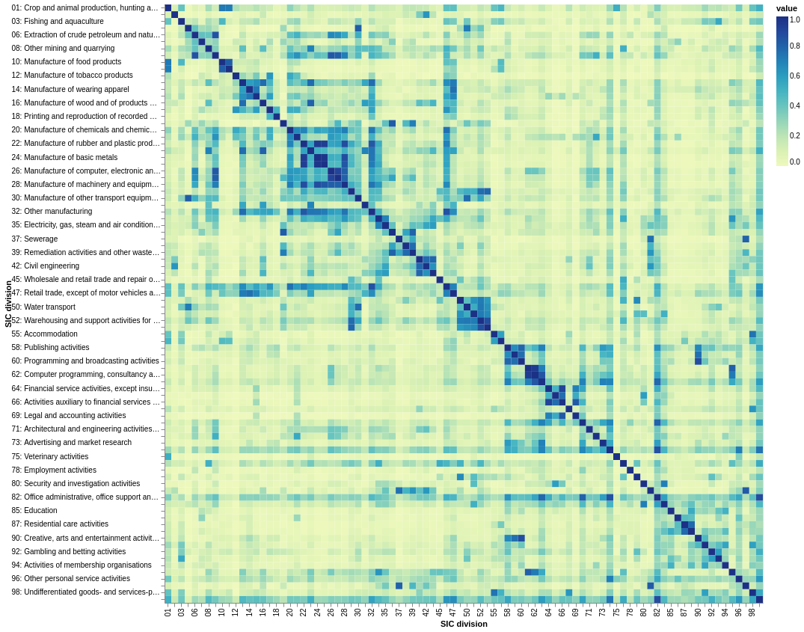{#fig:simple-L1 .altair}

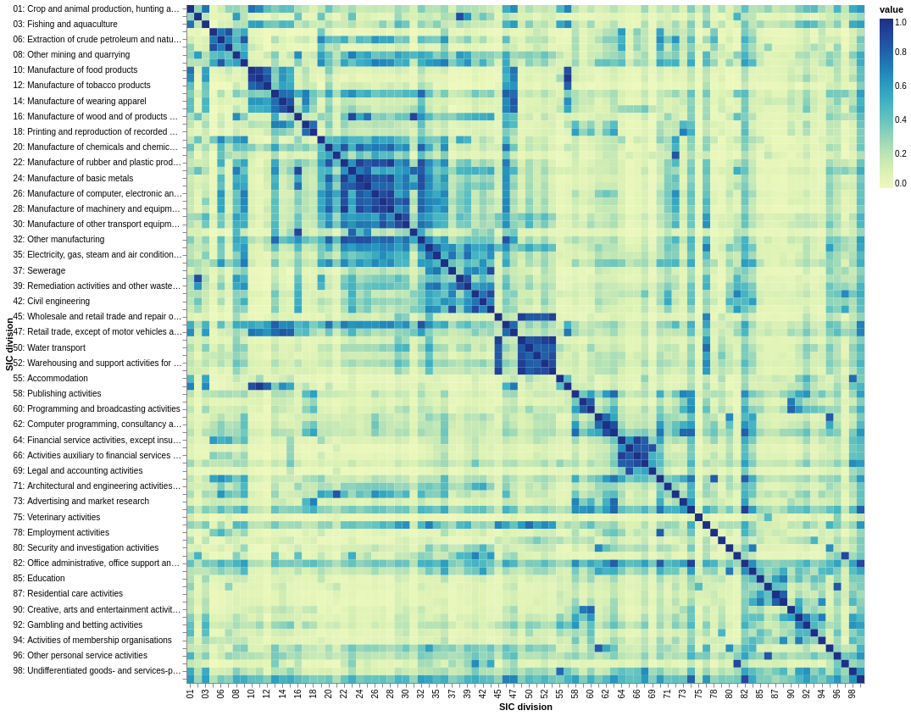{#fig:spacy-L1 .altair}

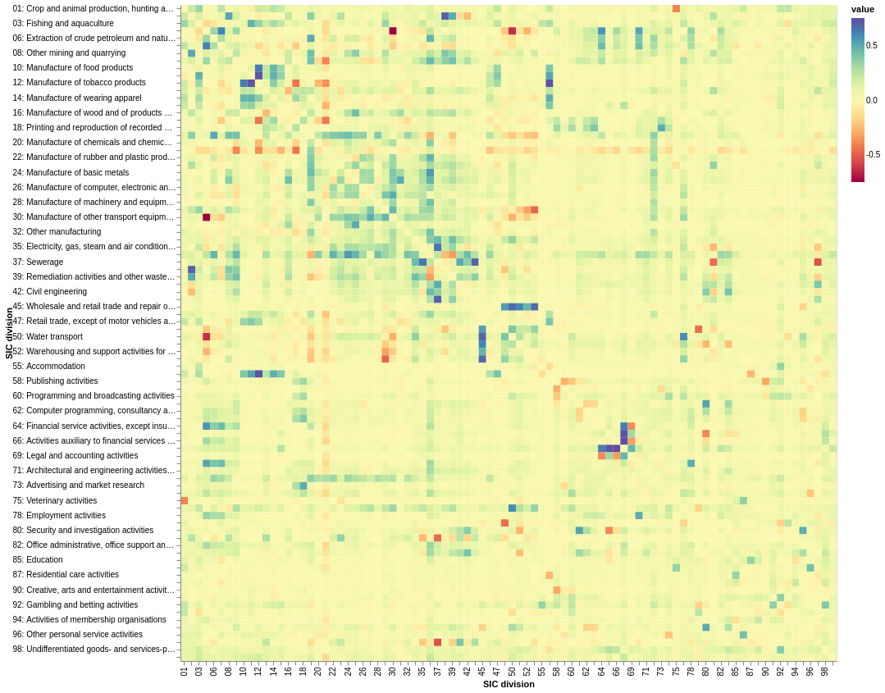{#fig:diff-L1 .altair}

### Level 2

The level 1 spacy model structure looks similar to a superposition of the simple model's level 1 and level 2 structure, hinting at a possible reason for some of the differences seen at level 1.
Continuing in the spirit of level 1, the spacy model exhibits a higher level of structure again.

The general observations seen at level 0 and 1 remain relevant; however the connectedness of sections is much higher.

Some interesting differences between the two models become more apparent now:

- Under the spacy model, 45-53 (trade, transportation and storage) are highly similar to 10-15 (manufacture of food, drinks and clothes) and moderately similar to other secondary sector activities. 
  However, under the simple model, 45-53 are much more similar to other secondary sector activities and some primary sector activities such as mining and quarrying than they are to 10-15.
  Common sense falls quite strongly on the side of the spacy model here.
- Under the spacy model Sections J, K, L, M (broadly high-paid tertiary-sector jobs) are highly similar to Section B (mining and quarrying) and 17-18 (manufacture of paper, printing, and recorded media). The first of these is peculiar and perhaps and artifact of the type of mining and quarrying companies which may have a web presence. The relation to 17-18 is highly logical.
- Interestingly the spacy model picks up 75 (Veterinary activities) as highly similar to Section Q (Human health and social work activities)


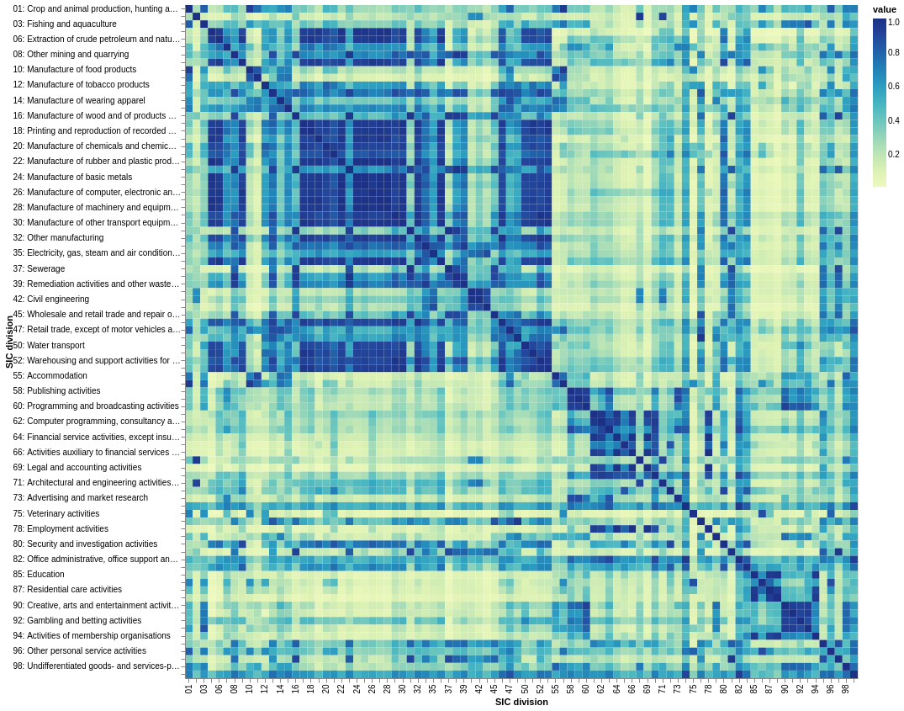{#fig:simple-L2 .altair}

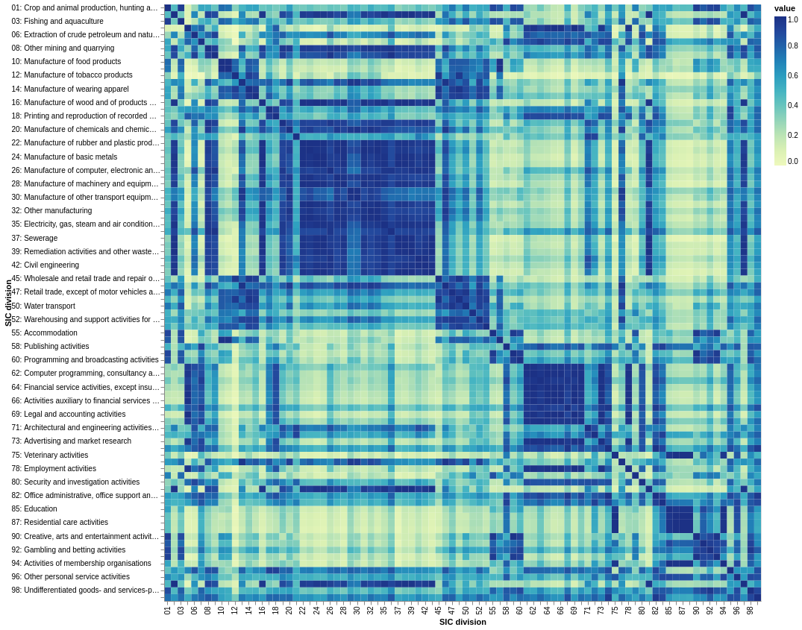{#fig:spacy-L2 .altair}

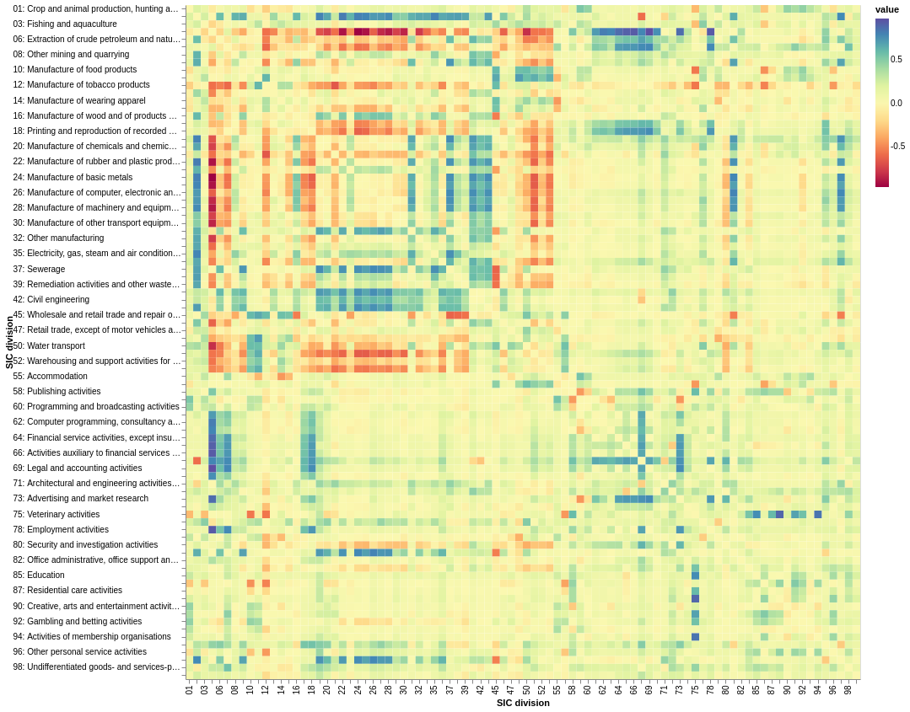{#fig:diff-L2 .altair}

# SIC heterogeneity

By aggregating the topic distributions by SIC, and calculating the entropy of the topic distributions for each SIC, we get one measure of the "heterogeneity" of sectors within the Glass data.

{#fig:hetero-division .altair}

<!-- 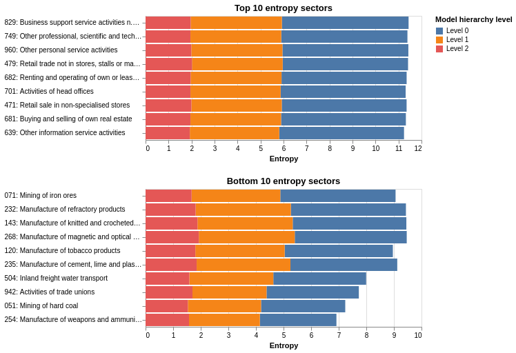{#fig:hetero-group .altair} -->

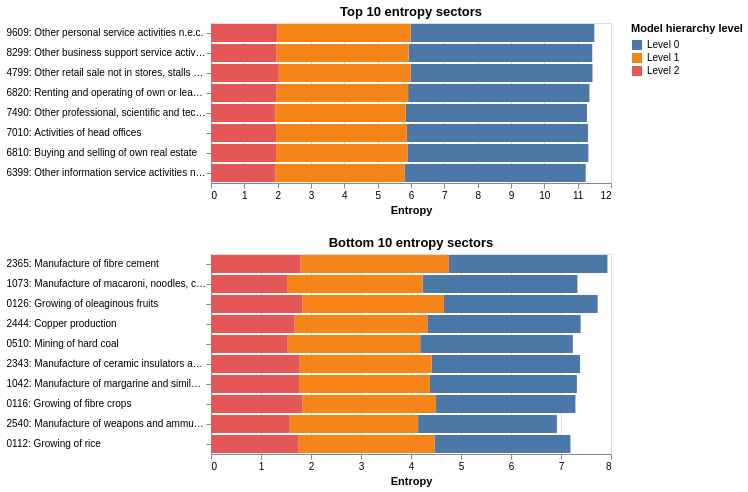{#fig:hetero-class .altair}

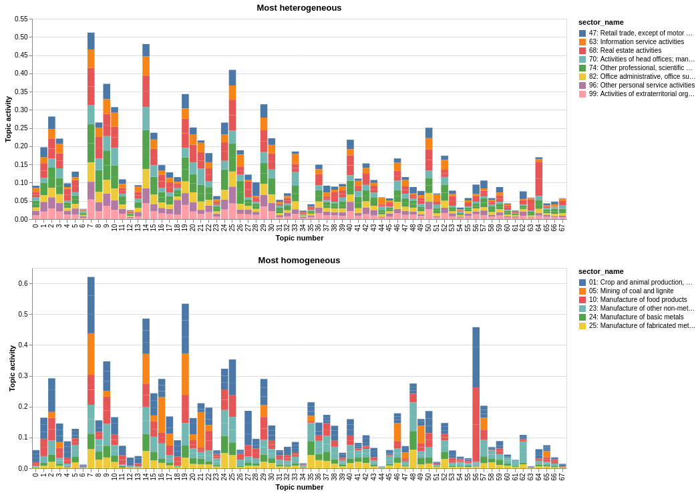{#fig:hetero-topic-dist-division .altair}

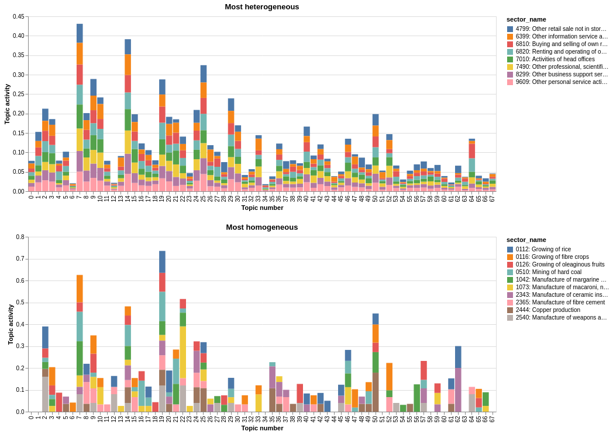{#fig:hetero-topic-dist-class .altair}

# Appendix

## Usage

### Get tokenised documents

```python

from industrial_taxonomy.getters.glass import get_description_tokens_v2

tokens = get_description_tokens_v2()
```

### Get topsbm model outputs

```python
from industrial_taxonomy.getters.topsbm import get_topsbm_v2

model = get_topsbm_v2()
```

### Generate SIC similarity plots

`python industrial_taxonomy/scripts/topsbm_sector_similarity.py`

### Generate SIC heterogeneity plots

`python industrial_taxonomy/scripts/topsbm_sector_heterogeneity.py`

## Potential Improvements

- Consider parsing documents with BeautifulSoup and converting XML to visible text before running these pipelines
