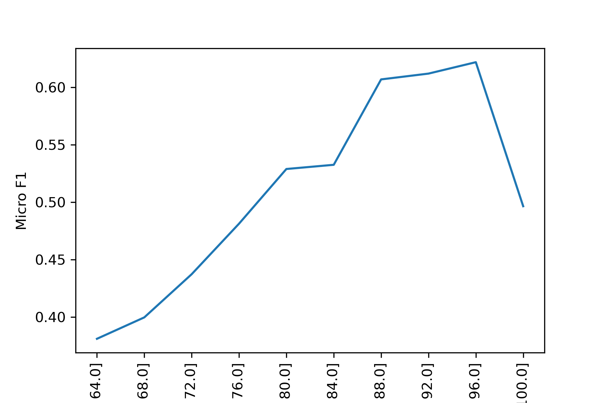
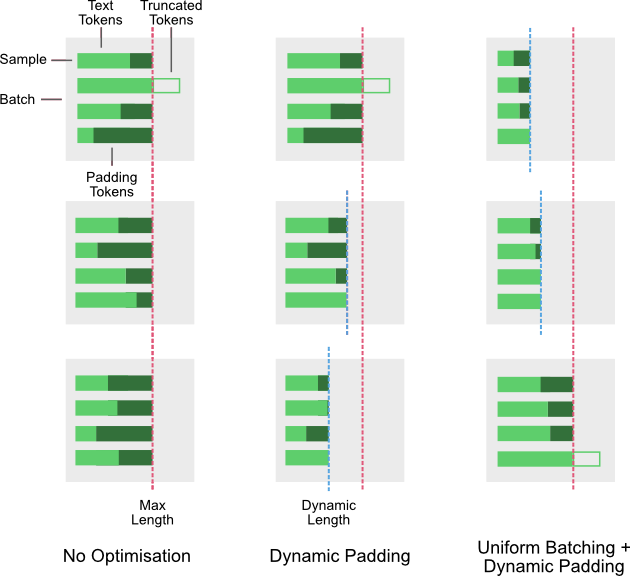
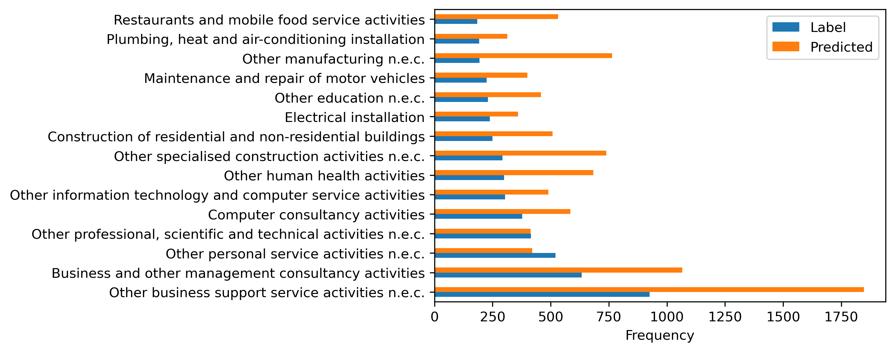
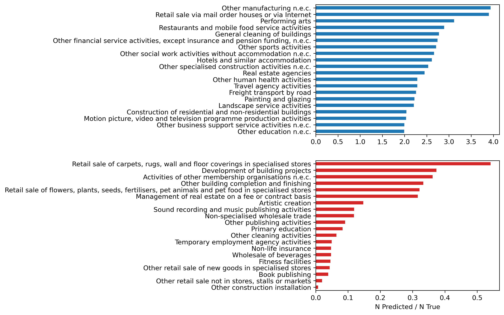

# Industry Classification using Company Descriptions

This short report details the process for creating a model to label companies with Standard Industry Classification (SIC) codes using their descriptions [@ons_uk_2007]. In this instance, a supervised machine learning approach has been developed, using text obtained from company websites by Glass AI and SIC codes from Companies House. Below, we describe the design choices, implementation and results of a SIC classifier trained on these data.

## 1. Introduction

The SIC index is a multi-level hierarchical levels industrial classification system. At the lowest level of granularity, there are 21 categories which are defined by broad industrial sectors. At the fourth level, one often used in microeconomic analyses, industries are divided up into 615 different classifications, detailing much more specific activities related to the production and distribution of products in the economy. The classifier built in this work has been trained to predict SIC codes for companies at this level, referred to from here as 4-digit SIC codes.

The objective of this work is to produce a classifier that can take the text description of a company as its input and predict an appropriate 4-digit SIC code for that company as its output. The model is a multi-class classifier but not a multi-label classifier in that it has been optimised to produce only a single label for a given description. 

The development of the classifier was treated as a supervised machine learning problem - one in which a labelled dataset is used to train a model. In practice, there are no official datasets that contain company descriptions and their associated SIC codes. In this case, we combined two sources of data to create our final training dataset. These are descriptions of companies obtained from their websites by Glass AI and the SIC code associated with each company from Companies House. These two datasets do not have innate fields that allow for direct joining therefore entries from Companies House were matched to their likely descriptions using a fuzzy matching approach. The details of this process are beyond the scope of this report, however some implications of the method in the modelling implementation are discussed below.

For the modelling itself, a transformer based approach has been taken. Transformers are a state-of-the-art neural network architecture that has shown to produce improved results on many language based machine learning tasks and have reduced the resources needed to create performant models. This family of model design has been rapidly adopted by the open source community, with tools such as the Transformers Python library allowing developers to easily obtain and use models for various natural language processing (NLP) tasks. Importantly for this work, the library provides *pre-trained* models, which have already been trained on a large corpus of text to recognise language patterns and can subsequently be adapted for new tasks with relatively little data. It is this approach that we use here.

## 2. Approach

Transformers and other neural networks are in large part able to learn complex linguistic relationships because of the large numbers of parameters that they contain. These parameters are the mathematical weights and biases that describe the relationships between different nodes inside the network and that ultimately produce the outputs for a model. Modern models can have many millions or billions of parameters to tune, which in turn requires large volumes of data and ultimately means that even with optimised software and hardware, training a model is time and energy intensive.

Fortunately, researchers have discovered that once a model has been trained on a large volume of data, the patterns that it learns are often highly generalisable. Transformers that are trained on language prediction tasks are often shown large corpora (e.g. the entirety of Wikipedia in a particular language) that contain so many examples of written language that they learn relationships that are applicable for many different tasks. Because of this, training a model from scratch is often unnecessary and instead, developers can opt to "fine-tune" an existing model for their specific problem.

The Transformers library makes this particularly easy by offering a harmonised tool for working with models built in different frameworks (TensorFlow and PyTorch), providing models that have been pre-trained on large datasets with accelerated hardware and allowing community members to share models with each other. It also provides an interface for fine-tuning those models. 

For the SIC code classifier, we fine-tuned an English language DistilBERT model using Transformers a transformer that has a reduced number of parameters to reduce disk space, memory use and training times. Under the hood, this process adds an additional, fully connected, final layer to the neural network that has a number of nodes equal to the number of classes being predicted. The entire model is then trained by feeding it the text examples in a dataset and allowing it to reduce the loss between the predictions made in the final layer and the labels in the dataset.

## 3. Implementation

In practice, several design choices were made in the development of this model. The first is that a higher match threshold between the Glass AI and Companies House datasets was chosen, compared to some previous work in the Data Analytics team. In an initial prototyping of the model to predict the highest level of the SIC index (the Section), it was noticed that predictions on company descriptions with a higher matching score yielded a higher F1 score. Figure [@Fig:f1_vs_matching_score_line] shows that the micro F1 score peaked after the bin from 73 to 76. Because of this, only company descriptions that matched to Companies House with a minimum score of 75 were chosen to train, validate and test the model.

{#fig:f1_vs_matching_score_line}

In total, after the matching threshold had been applied, there were around 350,000 samples for training. In this phase of development, only half of these were used for training, due to memory constraints on the machine being used.

Second, an optimisation technique was applied to mitigate a limitation of transformers that can slow down the training time for the fine-tuning process. Transformers are trained by passing data through the model in batches. Several examples of text are shown to the model before its predictions are evaluated against the true labels and the parameters are updated. In each batch, the number of input features - in this case, the input features are the tokens in the company descriptions -  must be consistent across all samples.  Because of this, shorter texts in a batch are padded up to the maximum length with a filler token that has no bearing on the model parameters.

In addition, transformers also have a maximum input size (for DistilBERT this is 512 tokens). Any examples in a batch can only be padded up to this length or a shorter length specified by the user. Any sequences longer than the specified maximum or upper limit are truncated.

This is relevant to the training speed as the time it takes for a transformer to process a piece of data is quadratic with its length. For any training process with variable length texts there is always the challenge of setting a maximum length that captures sufficient volumes of information in longer sequences and that does not impose a significant speed penalty. Fortunately, the batching process permits the use of dynamic padding and uniform batching, two techniques that when combined can offer a significant speed up.

Dynamic padding is the process of applying tokenisation at the point of batching the data, rather than on all data at the start of the model development process. In this way, a maximum length can be chosen that is no longer than the longest sequence in a batch. This helps by ensuring that no examples are padded more than they need to be. A global maximum can still be set to ensure no sample is padded beyond a certain length.

Uniform batching is the approach of grouping texts of similar length together before they are passed to the transformer in batches. In this way, the amount of padding needed in a given batch is reduced yet again. One way of doing this is by sorting the data by length to ensure that shorter texts are found close to each other.

A schematic for dynamic padding and uniform batching is shown in [@Fig: dynamic_padding_uniform_batching]. Both methods were applied to the data during the training process for the SIC classifier and resulted in significant speedups. The time for training dropped from over 2 hours to less than one hour.

{#fig: dynamic_padding_uniform_batching}

## 4. Results

Evaluating a model with 615 possible output classes is never an easy task, and in this case there are additional complicating factors. The first of these is that the 4-digit SIC code labels are often not appropriate for the business description. It is unclear whether this is due to the fuzzy matching resulting in some mismatched data or poor labelling on Companies House. A sample of randomly selected data is shown in Table x to demonstrate this. While the rate of error has not been calculated at this point, the rate is sufficient that it is very challenging to reliably make any absolute judgements based on established quantitative metrics such as recall, precision and F1 score. This is of course also a challenge for training the model, not only assessing the results.

Another flaw in the training data is that in some cases it is just not possible to determine the purpose of the company from the website description provided by Glass AI. This might be because the text describes other attributes of the company such as its founding story, the description may be very short or the text may simply be web related content. This means that many incorrect classification instances are simply due to the quality of inputs available on training and testing and do not relate to an actual company description that might be provided in downstream prediction tasks.

Another challenge is that the dataset is highly imbalanced. With a large number of classes it is already challenging to optimise an accuracy metric across all possible labels and this is exacerbated by class imbalance. While some labels are represented tens of thousands of times in the training data, many others are present fewer than ten times. At this point, no strategies to address this imbalance have been attempted such as under/oversampling, SMOTE or text augmentation. For evaluation, this means that there are not enough samples to meaningfully calculate accuracy metrics.

In the absence of reliable quantitative validation metrics, other means of assessing the model outputs have been attempted. One such method is to look at the frequency of top codes predicted by the model compared to the most frequent codes in the test data. [@Fig: predicted_true_freq_sic4_codes_barh] shows the frequency of labels which occur in the top 20 for both predicted and test labels. There are 15 labels that occur in both categories, suggesting that there is some similarity in the way that labels are distributed. However, we can also see that generally the predicted labels are occurring with a much higher frequency. This may be explained in part by the fact that many of the high frequency labels are general or catch-all labels, intended to cover industries "not elsewhere captured". There are several possibilities for why this is happening. One is that due to the noisy nature of the data, the model is not learning the subtle differentiations between companies working in related industries, and finds a lower error by simply classifying more companies into the general classes. This is potentially compounded by the imbalanced data, where those same labels are relatively highly frequent in the training data.

{#fig: predicted_true_freq_sic4_codes_barh}

To understand the level of over and underrepresentation of labels, [@Fig: predicted_true_freq_sic4_codes_barh] shows the ratio of predicted to "true" labels. The top plot shows the 10 most labels most overrepresented in the predictions, while the lower plot shows the 10 most underrepresented. 

{#fig: predicted_true_ratio_sic4_codes_barh}

At this point, the most reliable method of evaluation has been to test small samples of classifier outputs against qualitative personal judgement. A sample of 10 company description snippets with their true and predicted 4-digit SIC codes is shown below. From the sample we can observe 

| Description                                                                                                                                                                                              | Label                                                                              | Predicted                                                                        |
|:---------------------------------------------------------------------------------------------------------------------------------------------------------------------------------------------------------|:-----------------------------------------------------------------------------------|:---------------------------------------------------------------------------------|
| Meridian Financial Planning Ltd is a financial advice firm based in Whitfield, Dover, Kent offering financial advice to both individuals and corporate clients. We advise clients in the areas of Invest | Other financial service activities, except insurance and pension funding, n.e.c.   | Other financial service activities, except insurance and pension funding, n.e.c. |
| Red Production Company is a British independent television production company.                                                                                                                           | Motion picture, video and television programme production activities               | Motion picture, video and television programme production activities             |
| At Yeaveley Estate we have been offering Corporate entertainment since the early 1960’s; with a proven track record in corporate entertainment of over 50 years we are very confident that we have the e | Other amusement and recreation activities                                          | Renting and operating of own or leased real estate                               |
| Paul Horton & Roger Gough started DEK Graphics in 1994. Based on the Chandler's Ford industrial estate the business began as a traditional reprographics house, supplying film & platemaking services to | Photocopying, document preparation and other specialised office support activities | Other printing                                                                   |
| Founded by the world's leading AI and machine learning experts from University of Oxford, we're changing the way code is developed. Diffblue's CEO, Professor Daniel Kroening, is the inventor of CBMC,  | Other information technology and computer service activities                       | Computer programming activities                                                  |
| This is the official website of one of the UK's leading promoters, SJM Concerts. Here you'll find the most up to date news and tickets for some of the UK's most prestigious music events including V Fe | Other amusement and recreation activities                                          | Other business support service activities n.e.c.                                 |
| We are a 24 hour Police Station Agency/Criminal Legal Consultants that has been created and operated by an experienced Police Station Representative that formerly worked for a Legal Top 500 City Law F | Other professional, scientific and technical activities n.e.c.                     | Legal activities                                                                 |
| Turton Building Control provides a true alternative to local authority building control for obtaining building control approval on all types of building works. We operate nationwide and deal with all  | Other business support service activities n.e.c.                                   | Construction of residential and non-residential buildings                        |
| Breakspear Cars Ltd have been established since 2000. We're your one-stop reliable transport service,  for a single journey or an elaborate event you can rely on us. Whether you're calling on us for a | Taxi operation                                                                     | Taxi operation                                                                   |
| Stardust Music is a small group of some of the finest musicians based in Bristol, Bath and Oxford. We specialise in providing quality music for weddings and other events - this ranges from one of our  | Artistic creation                                                                  | Performing arts                                                                  |

## 5. Next Steps

- train on full data on bigger machine
- develop labelled test set
- Attempt a hierarchical approach
- hyperparameter tuning using Weights and Biases

## Why?

Find codes that the model struggles to find the limitations of the current taxonomy.
Hidden in what we're trying to infer is the noisy labelling in companies house
What's the distance between the SIC codes where the predicted label is different from the true label. Why does the model not know where to go? Ones where the generic label is chosen might be far semantically from the real label or the description.
How do we reverse engineer some of the sources of error to find out where they have happened? Bad/lazy labelling, bad matching. 

What values do SIC codes embed? Whose priorities do they represent? Why do we care about creating a data driven taxonomy? Whose interests does this serve?