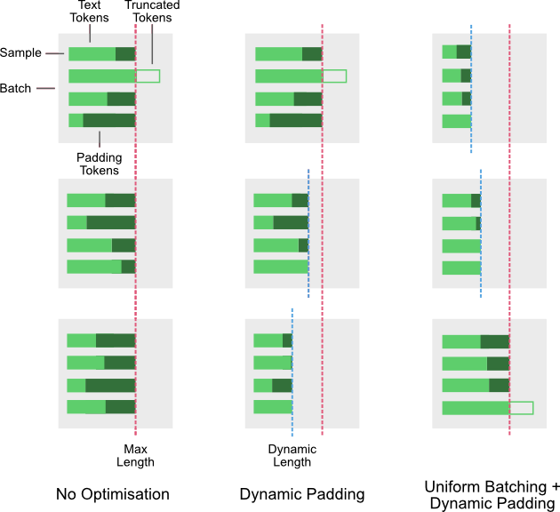
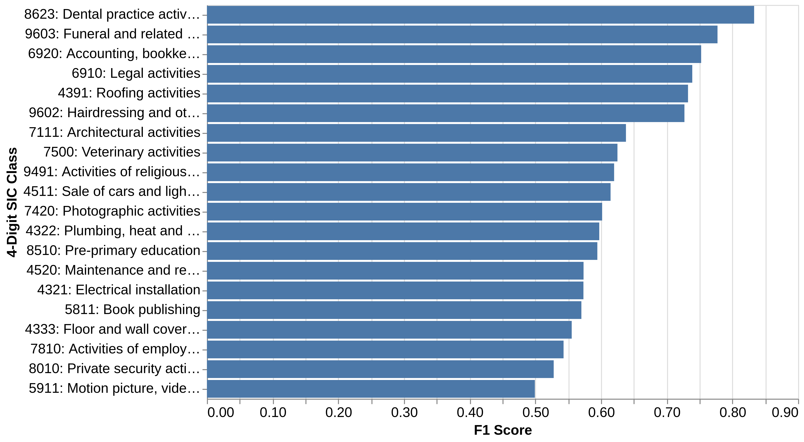
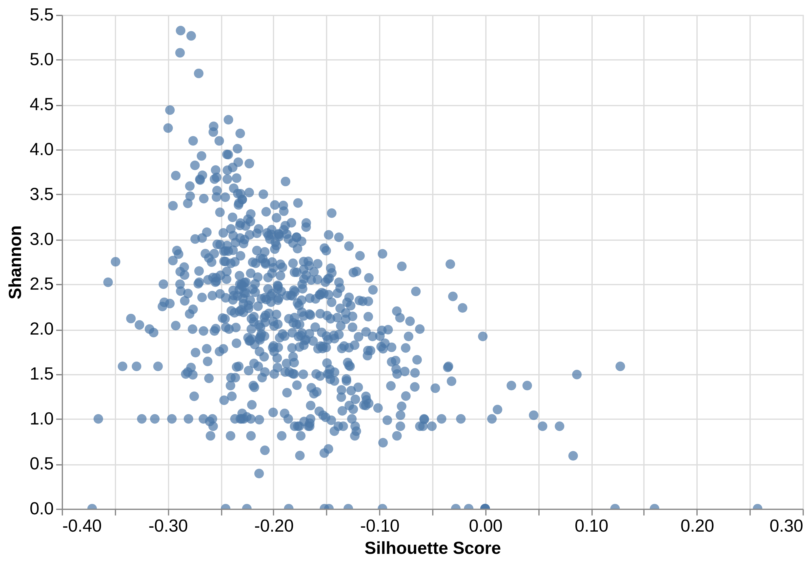
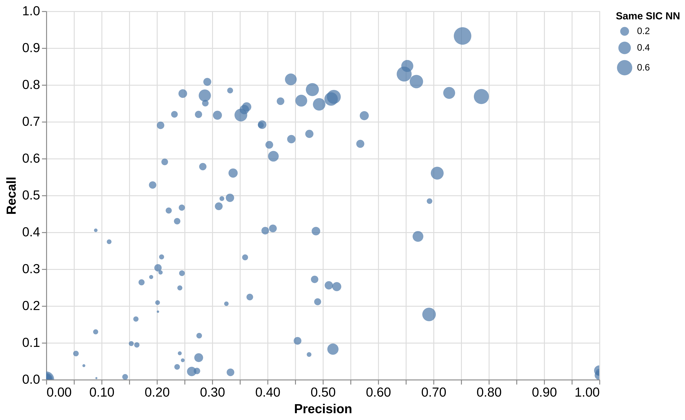
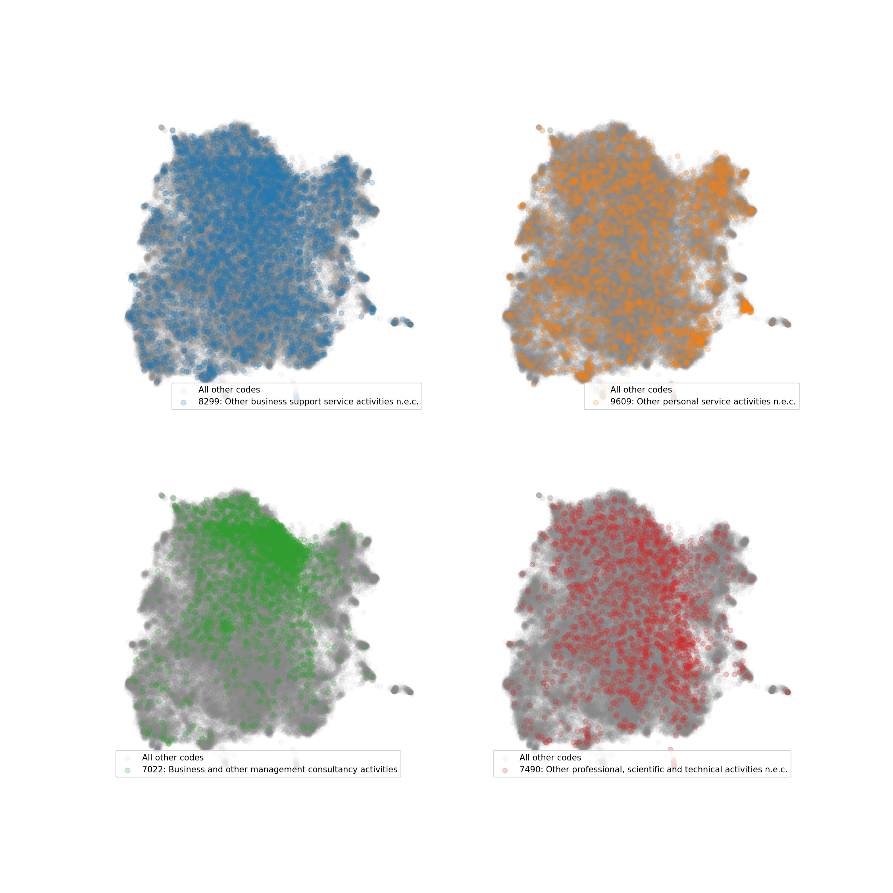

# Using predictive modelling to analyse the SIC taxonomy

How well can a machine learn the relationship between what a company says it does and the SIC code that company has been assigned? 

In this section, we attempt to answer this question by training a machine learning model to predict 4-digit SIC codes based on company descriptions and analysing the results. We do this in order to better understand the challenge of fitting companies into the SIC-2007 taxonomy based on the activities that they use to describe themselves, and identify opportunities to improve classification through the bottom-up taxonomy we develop later in the paper.

To do this, we have taken advantage of recent advances in machine learning, in particular neural network architectures known as transformers, which are particularly well-suited to natural language tasks. Transformers are capable of modelling linguistic relationships in ways that make them suitable for research and applications in text classification, question and answering, text summarisation, machine translation and text generation. They have been rapidly adopted by the open source community, with tools such as the Transformers Python library allowing developers and researchers to easily obtain and use models for various natural language processing (NLP) tasks [@wolf-etal-2020-transformers].

Importantly for this work, the library provides access to *pre-trained* models, which have already been trained on a large corpus of text to recognise language patterns and can subsequently be adapted for new tasks with relatively little data. Here we describe first how we have used such a model to predict SIC codes and second, how we have used machine learning performance metrics to understand where the model succeeds and struggles, which is informative about the limitations of the SIC taxonomy and how it is used by companies when they register in Companies House.

## Modelling methodology

### Transformers

We build a multi-class classifier that attempts to predict one of the 615 4-digit SIC codes, using the description of a company as its input. The development of the classifier is treated as a supervised machine learning problem - one in which a labelled dataset is used to train a model. As we have described above, there are no official datasets that contain company descriptions and their associated SIC codes. In this case, we have used the fuzzy matched data from Glass and Companies House to obtain a labelled dataset where SIC codes are associated with business descriptions.

We use a transformer model to construct the classifier. Transformers and other neural networks are in large part able to learn complex linguistic relationships because of the large numbers of parameters that they contain. These parameters are the mathematical weights and biases that describe the relationships between different nodes inside the network and that ultimately determine the relationship between the inputs of a model and its outputs. Transformers can have many millions or billions of parameters to tune, which in turn requires large volumes of data and ultimately means that even with optimised software and hardware, training a model is time and energy intensive.

Fortunately, researchers have discovered that once a model has been trained on a large volume of data for a particular task, the patterns that it learns are often highly generalisable. A transformer that is trained on a large corpus, such as the text from English language Wikipedia, for one task will result in a model with parameter values that represent a large number and diversity of patterns that are valuable for other NLP tasks. Because of this, training a model from scratch is often unnecessary and instead, developers can opt to "fine-tune" an existing model for their specific problem.

The `transformers` Python library makes this particularly easy by offering a consistent tool for working with models built in different frameworks (TensorFlow and PyTorch) and with different model architectures, enabling access to models that have been pre-trained on large datasets with accelerated hardware. This allows community members to share models with each other, reducing the amount of collective time and resources that must be spent on model training. It also provides an interface for fine-tuning those models. 

For the SIC code classifier, we fine-tuned an English language DistilBERT model [@sanh2019distilbert]. This is a transformer that has a reduced number of parameters to reduce disk space, memory use and training times, but that still performs competitively with larger models. The model was trained on a masked language modeling task where 15% of words in a sentence are randomly masked and the model must predict what those masked words are based on the unmasked content. This gives the model an inner representation of the English language that is then transferrable to a classification process. The additional component to turn the model into a classifier is the addition of a fully connected, final layer to the neural network that has a number of nodes equal to the number of classes being predicted (in our case 615 SIC codes). 

The entire model is then trained by feeding it the text examples in a dataset, requiring it to reduce the loss (error) between the predictions made in the final layer and the labels in the dataset. This process tweaks the values of all the parameters in the network, as well as the final classification layer.

### Implementation

In practice, several design choices were made in the development of this model. The first is the match threshold between the Glass AI and Companies House datasets. In an initial prototyping of the model to predict the highest level of the SIC index (the Section), we noticed that predictions on company descriptions with a higher matching score yielded a higher F1 score.^[The F1 score is the harmonic mean of a model's precision and recall i.e. its ability to predict true positives while avoiding false negatives.] The micro F1 score peaked when the match threshold was around 75, therefore only company descriptions that matched to Companies House with a minimum score of 75 were chosen to train, validate and test the model. In total, after the matching threshold had been applied, there were around 350,000 samples for training. In this phase of development, 80% of these were used for training, while 20% were held out as the test set for analysis.

Second, an optimisation technique was applied to mitigate a limitation of transformers that can slow down the training time for the fine-tuning process. Transformers are trained by passing data through the model in batches. Several examples of text are shown to the model before its predictions are evaluated against the true labels and the parameters are updated. In each batch, the number of input features - in this case, the input features are the tokens in the company descriptions -  must be consistent across all samples.  Because of this, shorter texts in a batch are padded up to the maximum length with a filler token that has no bearing on the model parameters.

In addition, transformers also have a maximum input size (for DistilBERT this is 512 tokens). Any examples in a batch can only be padded up to this length or a shorter length specified by the user. Any sequences longer than the specified maximum or upper limit are truncated. This is relevant to the training speed as the time it takes for a transformer to process a piece of data is quadratic with its length. For any training process with variable length texts there is always the challenge of setting a maximum length that captures sufficient volumes of information in longer sequences and that does not impose a significant speed penalty. Fortunately, the batching process permits the use of dynamic padding and uniform batching, two techniques that when combined can offer a significant speed up.

Dynamic padding is the process of applying tokenisation at the point of batching the data, rather than on all data at the start of the model development process. In this way, a maximum length can be chosen that is no longer than the longest sequence in a batch. This helps by ensuring that no examples are padded more than they need to be. A global maximum can still be set to ensure no sample is padded beyond a certain length.

Uniform batching is the approach of grouping texts of similar length together before they are passed to the transformer in batches. In this way, the amount of padding needed in a given batch is reduced yet again. One way of doing this is by sorting the data by length to ensure that shorter texts are found close to each other. A schematic for dynamic padding and uniform batching is shown in [@fig:dynamic_padding_uniform_batching]. Both methods were applied to the data during the training process for the SIC classifier and resulted in significant speedups.

{#fig:dynamic_padding_uniform_batching}

After training the model by following the steps above, the classifier was applied to the remaining 20% of company descriptions in the test dataset. These predictions form the basis of the analysis in the following section.

It is worth noting that the process described here presents some limitations, particularly in relation to the training data. 

1. The dataset has a high class imbalance. There are some SIC codes with many thousands of examples and others with only a handful. This means that the information available to the model for learning some SIC codes is significantly larger than for others. 
2. We cannot consider the labelled dataset as a gold standard, as manual inspection of the data shows that in some cases the label associated with a company description does not constitute a reasonable fit. In yet other cases, the description provided is not adequate to easily determine a single suitable label out of the 615 available, as a combination of codes would more suitably describe some organisation's activities. However, in some ways it is these aspects that make this analysis interesting.

## Model performance and analysis

Evaluating a model with 615 possible output classes is not a trivial task. Machine learning often involves making performance trade-offs both within and between classes and therefore the number of possible classes increases the complexity of this task by making the final optimisation objective more difficult to define. In this analysis we do not attempt to comprehensively determine the efficacy of the model, but rather make use of various metrics typically used within model evaluation to highlight findings that are relevant to understanding the limitations of the SIC-2007 taxonomy and informing the creation of a data driven alternative.

The first observation is that the classifier only makes predictions for 95 of the possible 4-digit SIC codes, despite the training data covering companies from all of the 615 codes. Classification metrics, such as precision, recall and F1 score are therefore only available for a subset of the codes, however we do shed some light on why this extreme aspect of low performance occurs by combining these with other metrics. 

In [@fig:sic4_f1] we see the most performant SIC codes according to their F1 score. We can see that there are only 6 codes with scores above 0.7, before a dropoff and gradual decline in scores. From a manual inspection of the results, there appear to be no obvious characteristics of the codes, such as industry type, that determines their performance, however it is worth noting that there are very few low-specificity codes (such as those that are defined by their inclusion of n.e.c. - not elsewhere classified) among the most performant. As we will see, the results are more nuanced than this. Overall, this highlights that the model struggles to assign companies a single label succesfully according to the test data.

{#fig:sic4_f1}

While this gives an overall impression of accuracy, it does not tell us much about the nature of the misclassifications. The set of companies with a particular SIC code may be misclassified into one other class or many, and these may relate closely to the original category or be very distant in terms of industrial activity. In order to determine the diversity of misclassifications for companies in each SIC code and to understand why this might be happening, we calculate two additional metrics: the Shannon index and the Silhouette score.

The Shannon index is a measure of entropy, often used to describe the diversity of states in a system. For companies in the test set with a SIC code, $i$, it is defined as

$$ H_{i} = -\sum_{j=1}^s\left(p_j\log_2 p_j\right) $$ {#eq:shannon}

where $s$ is the number of operational taxonomic units (in this case 615) and $p_{j}$ is the proportion of companies classified with SIC code $j$. This tells us the degree to which companies are misclassified into the possible codes.

Second, we calculate the silhouette coefficient for each SIC code. The coefficient is a metric that describes how well clustered a system is. That is how close points in a cluster are to other points in that cluster, as opposed to being close to points belonging to other clusters. In our case, we do this based on the company descriptions to understand whether companies labelled with a SIC code are clustered together with other companies with semantically similar descriptions, or whether they are dispersed in poorly defined clusters. 

To generate this value, we must first project the companies into some numerical space that represents the semantics of their descriptions. We use another pre-trained DistilBERT based transformer model for this task. We choose a version of this model that has been trained on semantic similarity tasks and without any further fine-tuning we process the company descriptions to produce dense 768 dimensional vector representations of the texts.

With each of the companies now occupying some point in semantic space, we calculate the mean sample silhouette coefficient for each SIC code. The sample silhouette score for a single company, $s(x)$, is defined as

$$ s(x) = \frac{b(x) - a(x)}{\max\{a(x),b(x)\}} $$

where $a(x)$ is the distance of a company description from all other companies with the same 4-digit SIC label and $b(x)$ is its distance from all other companies. We use the cosine distance as our distance metric. We then take the mean of the sample silhouette coefficient for all companies that are labelled with a 4-digit SIC code in the test set.

By comparing these two metrics we can see the degree to which companies within a code having dispersed descriptions determines the range of predicted SIC codes. Indeed, [@fig:silhouette_shannon] shows that a SIC code with a higher silhouette coefficient tends to lead to less diverse predictions. This makes intuitive sense as SIC codes whose company descriptions are less tightly clustered will necessarily have some overlap with other codes. This will result in a challenging situation for the classifier when it comes to learning and predicting for company descriptions that are in dispersed clusters or are on the periphery of their group. Almost all of the SIC codes have a silhouette score below zero, highlighting the degree to which this is the case. This means that in the majority of codes, company descriptions can be interpreted as more similar to companies in other industries than their own. It is also notable that there are some SIC codes which have a range of Silhouette scores but a Shannon index of zero, indicating that all companies in the test set with this code have been predicted into the same class. 

{#fig:silhouette_shannon}

However, a low Shannon index, driven by a high silhouette score does not necessarily mean that companies in that sector are well classified. In fact it may mean that companies in a SIC code with those characteristics are almost entirely misclassified into a single other code. A high Shannon index is also not necessarily a bad outcome, despite the fact that it points to apparent misclassification. For example, companies in a sector with a lower silhouette score might be resolved into a larger number of more appropriate sectors through the classifier's predictions. 

In [@tbl:shannon_silhouette] we can see that those sectors with a high Shannon index are those that are very non-specific and often uninformative, including several "n.e.c." codes. This suggests that many of the companies that were originally labelled with these sectors might be reclassified by the model into what it believes are more appropriate sectors.

|   SIC4 | Description                                                    |   Shannon |   Silhouette |
|-------:|:---------------------------------------------------------------|----------:|-------------:|
|   9609 | Other personal service activities n.e.c.                       |      5.32 |        -0.29 |
|   8299 | Other business support service activities n.e.c.               |      5.27 |        -0.28 |
|   7010 | Activities of head offices                                     |      5.08 |        -0.29 |
|   6420 | Activities of holding companies                                |      4.85 |        -0.27 |
|   4799 | Other retail sale not in stores, stalls or markets             |      4.44 |        -0.3  |
|   8110 | Combined facilities support activities                         |      4.33 |        -0.24 |
|   7490 | Other professional, scientific and technical activities n.e.c. |      4.26 |        -0.26 |
|   4719 | Other retail sale in non-specialised stores                    |      4.24 |        -0.3  |
|   6820 | Renting and operating of own or leased real estate             |      4.19 |        -0.26 |
|   6399 | Other information service activities n.e.c.                    |      4.18 |        -0.23 |
|   ...  | ...                                                             |      ...  |        ...   |
|   3091 | Manufacture of motorcycles                                        |      0.81 |        -0.19 |
|   3220 | Manufacture of musical instruments                                |      0.81 |        -0.26 |
|   3512 | Transmission of electricity                                       |      0.81 |        -0.24 |
|   2594 | Manufacture of fasteners and screw machine products               |      0.73 |        -0.1  |
|   1071 | Manufacture of bread; manufacture of fresh pastry goods and cakes |      0.67 |        -0.15 |
|   2311 | Manufacture of flat glass                                         |      0.65 |        -0.21 |
|   2219 | Manufacture of other rubber products                              |      0.62 |        -0.15 |
|   2363 | Manufacture of ready-mixed concrete                               |      0.59 |        -0.17 |
|   8623 | Dental practice activities                                        |      0.59 |         0.08 |
|   1083 | Processing of tea and coffee                                      |      0.39 |        -0.21 |

: The top and bottom 10 4-digit SIC codes sorted by the Shannon index of their predicted codes. Only codes with non-zero Shannon indices are shown. {#tbl:shannon_silhouette}

As the F1 score is the harmonic mean of precision and recall, it provides a view of model performance that attempts to balance these two measures of accuracy. This obscures the fact that for this task, there are codes which do not necessarily share the same level of performance across both metrics. To visualise the distribution of SIC codes across the dimensions of precision and recall, we plot the model performance according to these values in [@fig:precision_recall]. The resulting distribution suggests that there are two notable modes of classification - those where either precision or recall dominates. Codes that have a high recall and a low precision will be the result of a high proportion of false positives, suggesting that companies in other sectors might have descriptions that semantically similar to a large number of companies within the code. Codes that have a high precision and low recall suggest that there are sectors which have a well-defined core of companies with semantically similar descriptions, but other companies which the classifier believes fall better into other categories.

In addition to the precision and recall positions of the codes, [@fig:precision_recall] also uses the size of the points to highlight the degree of semantic overlap between companies labelled with that code. We placed the DistilBERT embeddings described above into a FAISS index to perform an efficient nearest neighbours search in semantic space [@Johnson_2019].

[^FAISS]: (Facebook AI Similarity Search) is a Python library to efficiently find similar observations in large multidimensional datasets.

For each 4-digit SIC code, we calculated the proportion of companies whose nearest neighbour is also in the same code, which is shown on the chart. In general, we can see that a higher accuracy, in terms of either precision or recall, occurs in sectors where the intra-code semantic overlap is higher, however there are some exceptions. An extension here would be to calculate metrics that account for both the overlap and dispersity to analyse whether it is indeed clusters with a tight semantically congruous core that result in high precision and vice-versa.

{#fig:precision_recall}

Overall, it is clear that there are sources of misalignment between many company's descriptions and the SIC codes that they are labelled with, and that lead to the prediction errors. A final demonstration of the impact of this is a visualisation of 4 of the less specific SIC codes across the semantic space of all company descriptions, namely 8299, 9609, 7022 and 7490. The 768 dimensional vectors are projected down to 2 dimensions for visualisation purposes via dimensionality reduction using the UMAP algorithm [@mcinnes2018umap] - see [@fig:embed]. Although it is not advised to draw conclusions about the exact relationship between two points according to their relative positions, due to fluctuations in the density of the space, some global trends can be determined. In this case, it is immediately clear that these codes are highly dispersed among companies with descriptions that cover the semantic space, and are neighbours to companies from a wide range of other sectors. This is likely to have a very large impact on the ability of the model to learn distinct patterns in the company descriptions belonging to these sectors, but also the sectors they they overlap with.

{#fig:embed}

## Conclusion

In this section we have demonstrated the challenge for state-of-the-art natural language classification to identify the appropriate SIC code for a company based on a labelled dataset. We show that this is in large part due to the degree and nature of semantic overlap of company descriptions within and between labels according to Companies House. 

In some cases, we believe that this is a result of uninformative codes being applied to companies that better belong to another, more specific sectoral label. In other cases, it is because a single label is inadequate to describe the company's activities as described by themselves on their business website. While it might be sufficient to use two or more existing codes to describe such companies, it might also be the case that a suitable code does not yet exist.

In other cases, the error may stem from companies being unintentionally mislabelled on Companies House due to a lack of guidance and clarity in the process of selecting an industrial code when establishing or updating a company's records. As one example, we found two companies in the dataset offering domestic and commercial electrical installations and testing with one labelled as belonging to 3512: Transmission of electricity and the other as 4321: Electrical installation. 

In conclusion, the data does not permit our model to satisfactorily learn how to classify companies according to their descriptions. This is a result of both typical limitations encountered in machine learning, such as class imbalance, the nature of the SIC-2007 taxonomy and its application to companies in the UK and, potentially, noise in company descriptions which make them hard to classify into sectors. This motivates and informs our pilot to develop a bottom-up industrial taxonomy in Section 5. 
