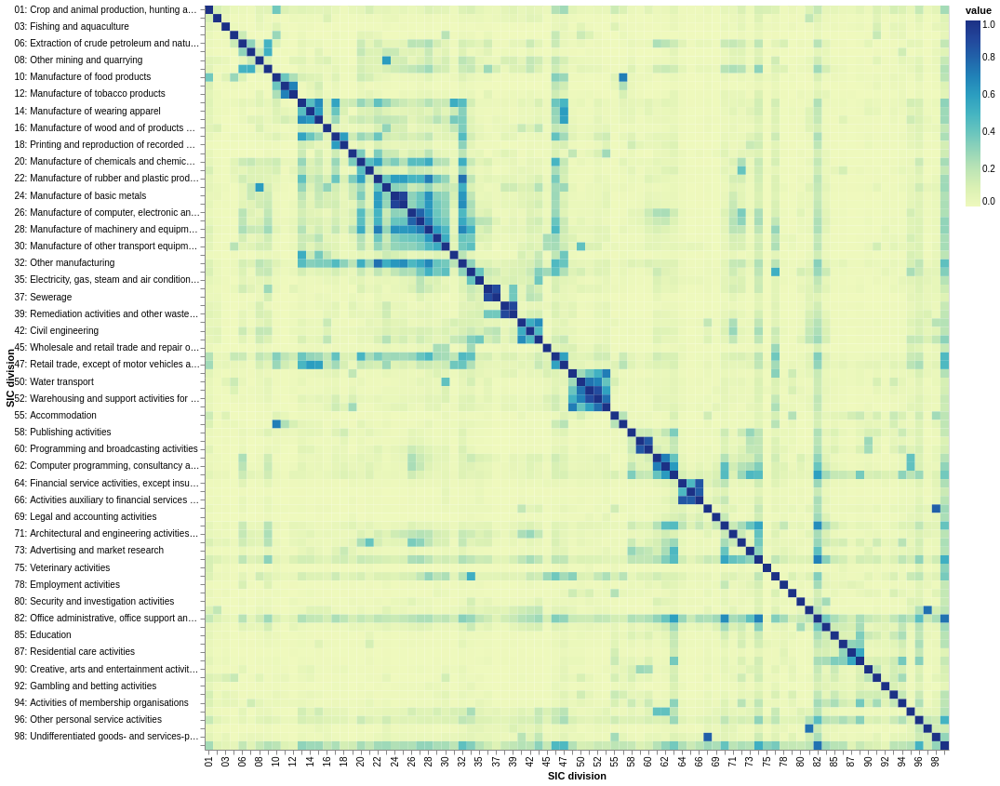
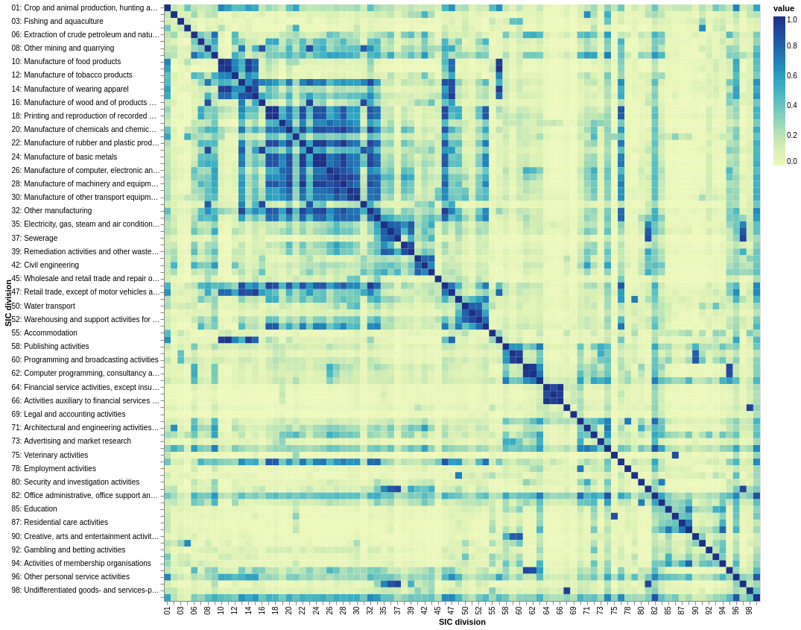
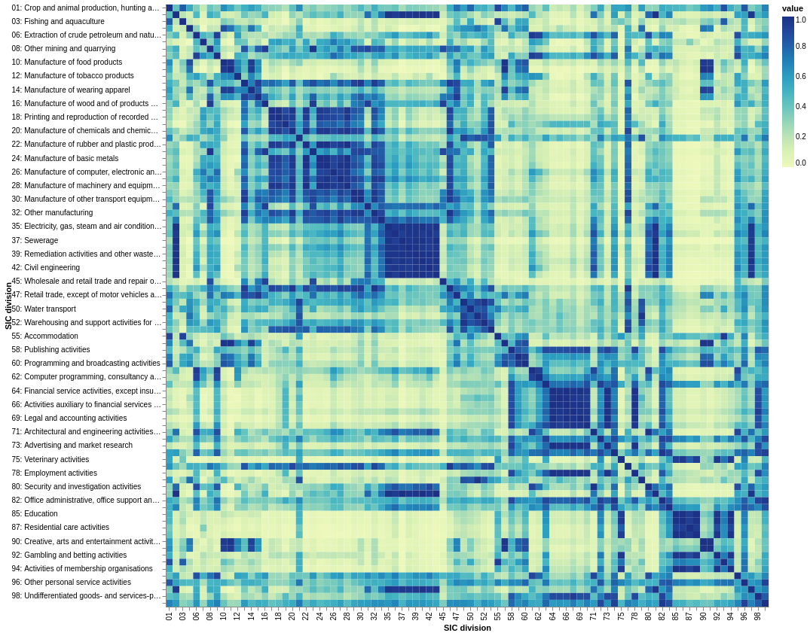
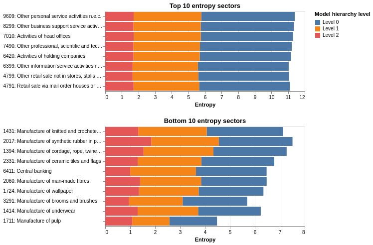

# Hierarchical Topic modelling {#sec:topsbm}

In this section, we present an unsupervised machine learning analysis where we train a hierarchical topic model on the processed Glass descriptions.
This allows us to assess the semantic heterogeneity of 4-digit SIC codes
(i.e. the extent to which they contain companies with widely varying descriptions of their activities)
as well as semantic overlaps between codes in different parts of the SIC taxonomy.

The hierarchical topic model approach used is the TopSBM [@topSBM] model.
This approach confers multiple advantages over the more traditional Latent Dirichlet Allocation (LDA) [@LDA] frequently used in the literature such as automatically selecting the number of topics; yielding a hierarchy of topics; permitting a more heterogeneous topic mixture than is permitted by LDA; and, crucially for the analysis of [@sec:similarities] generating document clusters.
Theese benefits are not without cost - due to the high memory use of this methodology we use only $100,000$ Glass descriptions (those with the highest match score to Companies House are selected) to fit the model.[^ram]

[^ram]: Fitting the model on $100,000$ documents required use of a machine with 64GB RAM.

| Level | Number of topics | Number of clusters |
| ----: | ---------------: | -----------------: |
|     0 |              384 |                370 |
|     1 |               74 |                 56 |
|     2 |               11 |                 11 |
|     3 |                2 |                  3 |

: Number of topics and number of document clusters for top 4 levels of the fitted model's hierarchy. {#tbl:hierarchy}

## SIC similarities {#sec:similarities}

[@Fig:sim-L0;@fig:sim-L1;@fig:sim-L2] show the cosine similarity between SIC divisions calculated using the three most granular levels ([@tbl:hierarchy]) respectively of our hierarchical topic model.

The similarities are calculated by aggregating documents into SIC codes (division level) and calculating the cosine similarity between the document cluster distribution of divisions.
We choose the division level to discuss this component of analysis at because it is the most granular level of the SIC taxonomy at which it is feasible to visualise and compare pairwise similarities.
The most appropriate level of our model hierarchy to analyse SIC similarity at is more subjective -
lower levels pick out very strong relationships which hold in the presence of a finer topic/cluster structure, whereas 
higher levels better pick out higher-order structure.

{#fig:sim-L0 .altair}

{#fig:sim-L1 .altair}

{#fig:sim-L2 .altair}

The diagonal block-structure (particularly visible in [@fig:sim-L2]) corresponds to the SIC taxonomy structure; however there is also significant off-diagonal structure which highlights the richness of novel data-sources such as business website descriptions.

For example, divisions 10-15 (broadly the manufacture of food, beverage, and clothes) are highly similar to divisons 56 (food and beverage service activities) and divisions 46-47 (wholesale and retail trade).
Many similar intuitive relationships exist across related extraction, manufacturing, and services industries in disparate parts of the SIC taxonomy.

[@Tbl:list-of-sims] lists a few more intuitively similar SIC divisions which are not captured by the SIC taxonomy but are well-captured by the Glass data and topic modelling approach.

| Division group 1                                                  | Division group 2                                                 |
| ----------------------------------------------------------------- | :--------------------------------------------------------------- |
| 21 - Manufacture of pharmaceutical products                       | 72 - Scientific R&D                                              |
| 33 - Repair and installation of machinery and equipment           | 77 - Rental and leasing activities                               |
| 33 - Repair and installation of machinery and equipment           | 95 - Repair of Computers and personal and household goods        |
| 81 - Services to buildings and landscape activites                | 97 - Activities of households as employers of domestic personnel |
| 59 - Motion picture, video and television programme production... | 90 - Creative arts and entertainment activities                  |

: High similarity pairs of divisions not captured by the SIC taxonomy. {#tbl:list-of-sims}

The fact that the SIC taxonomy does not capture these relationships is more a limitation of imposing a single hierarchy (in the form of a taxonomy) than a limitation of the SIC taxonomy itself.

Finally, we note that many sectors possess a high degree of similarity to many (if not most) industries -
 e.g. _Office administrative, office support, and other business support activities (82)_ - 
 as they offer services which apply across industries.
It may be the case that these services are offered across industries by one business or that each business may specialise in offering those support activities within a specific industry.

## SIC heterogeneity

By aggregating the topic distributions by SIC, and calculating the entropy of the topic distributions for each SIC, we create a measure of the "heterogeneity" of sectors within the Glass data.
[@Fig:hetero-class] shows the ten most heterogeneous (highest entropy) and ten least heterogeneous SIC classes according to this measure.
The most heterogeneous sectors such as _Other personal services not elsewhere classified_ are sectors that a company may be labelled as because their activity is not well-captured by an existing SIC code.
Such sectors are prime candidates for reclassification in some way such as adding further levels of depth to the SIC taxonomy for these highly heterogeneous codes - we explore a strategy to do this in Section 5.

{#fig:hetero-class .altair}

[@Fig:hetero-topic-dist-division] plots the distribution of 'topic activity' for the 20 most heterogeneous sectors.
The contribution towards 'topic activity' from each SIC code is expressed in terms of the fraction of the mean activity in each topic across all SIC codes -
this highlights more important topics and de-emphasises topics which are common to many or all industries.
Thus topics on the left of the figure correspond to the topics which are over-represented in heterogeneous SIC codes, which contain terms around digital marketing, consultancy, property management, recruitment, and finance.

{#fig:hetero-topic-dist-division .altair}

## Conclusion

The analysis of this section has highlighted the rich structure which can be captured by business website description data - picking up both structure defined by the SIC taxonomy and structure that is not captured by the SIC taxonomy.

Furthermore, by analysing the heterogeneity of SIC codes (based on semantic overlap) we can identify the small parts of the SIC taxonomy that are less useful and may benefit from reclassification or a more granular description that captures emerging industries.

The simultaneous construction of a hierarchy of topics and clusters would be a prime candidate for bottom-up taxonomy creation were it not for the fact that the method did not scale to the full Glass dataset. Next section we leverage the structure of the SIC taxonomy to implement a similar clustering strategy in a more scalable way.
