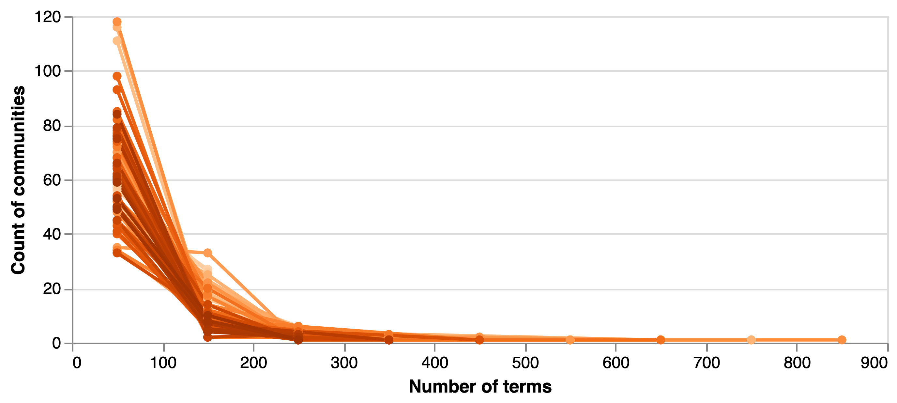
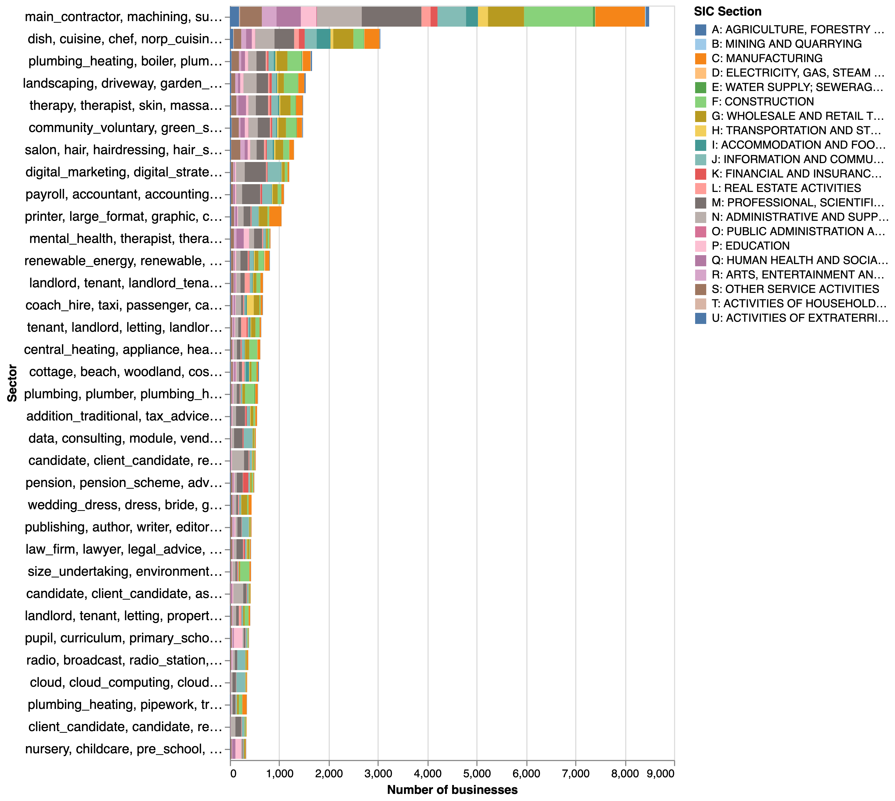

# Pilot strategy to develop a bottom-up industrial taxonomy {#sec:taxonomy}

Sections 3 and 4 have provided empirical evidence of important limitations of the SIC-2007 taxonomy. They include the mismatch between business descriptions and codes for some of the SIC codes, the strong overlap between codes in different parts of the taxonomy, and the presence of semantically heterogeneous 'not elsewhere classified' codes that attract very different types of economic activity as well as some companies that could be classified elsewhere in the taxonomy.

In this section we pilot an approch to build a bottom-up taxonomy based on company descriptions that addresses some of these limitations. Here are some of its features:

1. It draws on the SIC-2007 taxonomy: instead of replacing SIC-2007 with a new structure, we start at a relatively low level of resolution (SIC-4) in the SIC-2007 hierarchy and seek to decompose those categories into more granular sectors through a network analysis that we detail below.^[We note that there is a five-digit SIC category below the four digit but this includes a small number of codes - 191 versus 650 in the SIC4 - that tend to add limited information to what is available at the higher level.] 
2. Its production is automated: The categories within the taxonomy are identified and named automatically with some manual tuning of key parametres to increase the intepretability and relevance of outputs.
3. It can be used to tag companies with laabels for multiple sectors: This helps overcome the rigidities of the SIC taxonomy by accommodating companies that operate in several industries. it also makes it possible to remove 'duplicate sectors' extracted from different SIC4 codes, and, potentially to reconstruct the hierarchy of the bottom-up industrial taxonomy through an agglomerative clustering of the network of sector co-occurrences in companies.

In order to pursue these goals, we have to build a a complex pipeline that we describe in the rest of this section, presenting emerging findings as we go. Before doing that, we provide a high-level methodological narrative that summarises the conceptual model informing our approach and the steps we have taken to implement it (see [@fig:4_0].

## Methodological narrative

{#fig:4_0}

We think of industrial sectors as a set of latent constructs $I=\{i_1,...,i_n\}$ where industry $i_k$ is manifested in a vocabulary of words $S_k=\{w_1,...,w_m\}$ about products and services, production processes and technologies that happen with a high probability in the description of companies that operate in it. As an example, the video games sector may be comprised of a vocabulary including _console_, _game_, _video game_, _adventure_, _role playing game_, _app_ etc.

I addition to this set of sector specific words $S$, there is a  set $G$ of generic words that are uninformative about the sector that a company operates on. This may include general business terms as well as marketing language used to promote products and services online. 

The challenge that we face is to infer $I$ from the distribution of $S$ and $G$ in our corpus of company descriptions. In order to do this, we would like to (1) remove from company descriptions all $w_i \epsilon G$ that are uninformative about the sector where a company operates, and to (2) identify clusters of words such that their words $w_i \epsilon S_k$. The text processing stage of our analysis sets out to achieve (1) and the community extraction stage sets out to achieve (2). 

More specifically, in (2) we construct a network of words based on their co-occurrences in companies and deconstruct that network into a set of commumnities $C = \{c_1,...c_n\}$ composed of densely connected (frequently co-occurring) words. We assume that $C_k \sim S_k$ - each of the resulting communities of words is a representation or proxy of latent sector $k$. As noted in the first feature of our taxonomy, we undertake this community detection _inside_ each SIC4 code.^[Undertaking our community detection at the SIC-4 level also gives us a ready-made way to remove generic business terms - those that appear in many different SIC4s - and makes the community detection effort more computationally tractable by reducing the size of the networks we work with.]

Having identified a set of word communities that proxy 'sectors', we move into a company labelling stage where we identify a set of companies $F_k=\{f_1,...,f_n\}$ such that a company $f_j \epsilon F_k$ if $w(f_j)\cap{S_k}> \tau$, where $w(f_j)$ is the set of words in the description for company $f_j$, and $\tau$ is a critical value. We also use the salient terms in each of these labelled sets to name the community $C_k$ and calculate the semantic homogeneity of those terms to proxy a community's coherence (that is, we consider communities whose salient terms are more similar to each other to be more coherent than communities composed of heterogeneous salient terms).

In the post-processing stage, we clean and expand our list of sectors and labelled companies.

The labelling approach described above makes it possible for us to tag a company with multiple sectors that occur frequently in it. Some of these co-occurrences may reflect situations where a company straddles sectors (e.g. a fintech company tagged with a financial sector label and a software sector label) but in others it may simply capture sector duplicates across SIC4 (i.e. situations where due to misclassification a subset of a sector $I_k$ is placed in SIC4 $A$ and another subset in SIC4 $B$). We merge duplicated communities and replace them in our tagged company set.

One limitation of our labellling strategy is that it will only capture companies that include the exact words in a sector vocabulary $S_k$, potentially excluding relevant companies that use synonyms or are below our hard threshold $\tau$. In order to improve the recall of our approach we vectorise all company descriptions in our corpus and calculate the distance between the vector representation of each unlabelled company and a vector that summarises each of our sectors $i_k$ with the average of the vectors for all companies classified in that sector, $F_k$. We assign each unlabelled company $u$ to $F_k \mid d_{l,i}=min(d_{l,i\epsilon K})$ if $d_{l,i}<\rho$, another critical value.

The rest of the section goes through these steps providing additional detail about our implementation of relevant methods and emerging results. Before doing this we note that in the text we will refer interchangeable to communities (of words) that represent sectors, and the sectors that compose the bottom-up taxonomy we are developing.

## Text pre-processing {#sec:1}

We start our analysis with just over 340,000 business website descriptions that have been matched with Companies House with a high level of certainty (match score above 75). The dataset includes 611 SIC4 codes (99% of all SIC4s). We have also tokenised their descriptions, performed named entity recognition to identify tokens that represent locations, company names, times etc. and removed those, and estimated n-grams (i.e. combined pairs and triads of tokens that occur frequently in the corpus, such as `city` and `centre` into a single token `city_centre`).^[In the text that follows we will refer to these tokens, which may be unigrams, bigrams or trigrams, as 'terms'.] 

We now want to subject this corpus of company descriptions to additional processing in order to generate individual company descriptions primarily comprising sector-specific ($S_i$) terms. To achieve this, we:

### Filter low sector salience terms
We concatenate all tokenised company descriptions inside each SIC4, calculate term frequency per SIC4 and calculate their TF-IDF score (this roughly normalises the occurrence of a term in the SIC4 code over its occurrence in the whole corpus) and keep, for each SIC4, only those terms in the top 5% TFIDF score. 

We find that even after taking this step, the resulting SIC4 vocabularies still contain a large number of generic business terms - this is because word frequencies are highly skewed, with a small number of frequently occurring terms that overlap between sectors. To adress this, we remove all terms that are present in the salient vocabularies of more than 50% of SIC4s.

[@Tbl:4_1] compares a random set of 10 terms in selected SIC4s before and after the application of this additional filter - we note that a significant number of non-sector specific terms remain. We have decided against setting a more strict threshold for exclusion of salient terms because these resulted in a significant decrease in the size of company-level vocabularies, particularly for "not elsewhere classified" SIC codes whose salient terms are more evenly distributed across the corpus of business descriptions.

|      SIC4    | Filter 1                                                                                                                                                                                   | Filter 2                                                                                                                                                                                               |
|-------------:|:-------------------------------------------------------------------------------------------------------------------------------------------------------------------------------------------|:-------------------------------------------------------------------------------------------------------------------------------------------------------------------------------------------------------|
|     0123     | green, long_term, having, population, standard, unique, business, local, processing, strawberry, add_value, salad, security, produce, bakery, custom, people, ingredient, farm, successful | garden, fruit_vegetable, farm, cut_flower, able_provide, simon, add_value, fruit, paradise, hope, future_generation, custom, employ, bit, bakery, live, long_term, formulation, ingredient, having     |
|     6201     | culture, turn, popular, late, place, multi, aim_provide, help, small_business, seek, dedicate, security, demand, perform, help_achieve, tech, know, crm, standard, mind                    | reflect, journey, low, forefront, visual, critical, goal, optimise, stay, understanding, speak, generation, suit, explore, utilise, intuitive, form_date, creative, legal, expect                      |
|     7490     | page, private, loc_loc, original, total, identify, line, exist, qualification, innovative, assess, sale, relate, base, experienced, policy, operate, able_provide, global, offer_range     | explore, etc, website, prepare, example, demonstrate, appointment, selection, learn, plant, plan, detailed, necessary, healthcare, good_practice, consultancy, talent, maximise, specification, scheme |
|     9999     | financial, kind, enable, rely, run, accredit, consultant, campaign, study, transport, whilst, idea, industrial, quote, class, enjoy, time, found_date, locate_gpe, cut                     | think, website, sign, packaging, offer_range, turn, gift, outside, flexible, early, specification, member_org, practice, student, travel, original, save, successfully, clear, direct                  |

: Randomly sampled terms extracted from sector vocabularies after applying filter 1 (only keep terms with tfidf score in top 5% for sector) and filter 2 (removal of terms that are present in more than 50% of sectors) {#tbl:4_1} 

### Removing marketing tems

We apply an additional filter to remove promotional and marketing terms that companies use to advertise their products and services in their websites but are uninformative about the sector where a company operates. 

In order to do this, we use VADER (Valence Aware Dictionary for Sentiment Reasoning), a sentiment analysis model which scores words based on their polarity (whether they express a positive or negative sentiment) and intensity [@hutto2014vader]. We apply the NLTK implementation of VADER to every term in our corpus and remove those with a high polarity score (above 0.5) [@loper2002nltk]. This leads us to remove 720 terms from our vocabularly. [@fig:4_1] displays the highest vocabulary terms in our vocabulary.

{#fig:4_1}

In [@fig:4_2] we present the mean number of promotional terms per SIC-2 (division). We have removed the labels from the bottom to increase readability and added the codes for the top five divisions in the table - they are consumer-oriented products and services such as Accommodation (55), Food and beverage service activities (56), Travel agency, tour operator and other reservation service and related activities (79), Education (85), Manufacture of food products (10).

{#fig:4_2}

[@Fig:4_3] summarises the results of our filtering exercise: we reduce the mean number of terms in company descriptions significantly (by 72% on average). This is particularly visible for Not Elsewhere Classified sectors (cross shapes). The chart also illustrates the stronger presence of services sectors in our dataset.

{#fig:4_3}

## Community extraction

Having filtered the terms in company descriptions, we move to the creation of a term co-occurrence network inside each SIC4, and its decomposition into communities representing sectors, focusing on 80 SIC4s in our dataset that contain more than 500 companies.

### Creation of co-occurrence networks

Each term co-occurrence network comprises a collection of nodes $N = \{n_1,...n_m\}$ where $n_i$ is a term within our filtered set, and a collection of edges $E = \{e_1,...e_k\}$ with weights $W=\{w_1,...w_k\}$. The value of the weights represent the number of instances that two nodes $n_i$ and $n_j$ co-occur in a company description in the SIC4. 

We treat terms that occur in more than 20% of the company descriptions as 'stop terms' which are less useful for our community detection purposes, and simplify the network. This involves removing edges with low weights by extracting their maximum spanning tree - the set of nodes and edges in $N$ that preserves a fully connected network with the maximum sum of weights [@asano1988clustering]. This has the goal of making the network sparser while preserving the strongest connections that may be indicative of community structure. We add to this network the top 20 edges by weight from the original network that had been removed by the maximum spanning tree.^[This has the goal of preserving more structure from the original network. We preserve a relatively low number of edges in order to reduce the computational complexity that we have to tackle in the community detection stage of analysis.]

### Community detection

Community detection (or discovery) techniques seek to learn the structure of networks by partitioning them into groups of nodes that are densely connected internally and less connected with nodes in other communities [@fortunato2016community, javed2018community]. 

There are dozens of community detection algorithms developed in many different disciplines and we do not have strong priors that a particular algorithm will be specially effective for decomposing our term co-occurrence networks so we adopt a grid-search strategy to tackle our challenge. This entails selecting an ensemble of algorithms and range of potential parameters, using them to partition our networks, and comparing the modularity of the results. [tbl:4_2] summarises the ensemble of community detection algorithms that we have used, as implemented in the `cdlib` python library [@rossetti2019cdlib]. 

|Algorithm         | Reference           | 
|------------------|-------------------|
|Louvain         | [@Blondel_2008]|
|Leiden         | [@Traag_2019]           | 
|AGDL         | [@10.1007/978-3-642-33718-5_31]  | 
|Chinese whispers         | [@ustalov2019watset]           |
|Label propagation      | [@raghavan2007near]           |
|Markov clustering | [@enright2002efficient]           |
: Community detection algorithms implemented in our analysis {#tbl:4_2}

[@Fig:4_4] presents the modularity scores achieved by different community detection algorithms by SIC4, and the size of the communities extracted.^[We use the Erdos Renyi modularity score, which captures the extent to which intra-community connections happen at a higher rate than would be expected if nodes were connecting randomly [@mcdiarmid2018modularity]] In general, the Leiden and Louvain algorithms, which recursively assign nodes to communites with the goal of optimising the modularity score perform most effectively while extracting a relatively small number of communities. Perhaps as expected, we find that "not elsewhere classified" SIC4s tend to achieve more modular network partitions, suggesting a higher degree of heterogeneity and scope for decomposition into additional subsectors.

{#fig:4_4}

### Robustness

Do the best performing community detection algorithms tend to partition terms in the same communities? To evaluate if this the case we calculate, for each SIC code the normalised mutual information between the partitions generated by pairs of algorithms in the top three by modularity score.^[Normalised mutual information captures the correlation between two partitions, with a score of 1 for perfect correlation and a score of 0 for a independence.] 

As [@fig:4_5] shows, the normalised mutual information scores tend to be high (between 0.75 and 0.98), suggesting that the outputs of our community detection efforts are robust to the choice of algorithm. We note that sectors in "Other" / "Not elsewhere Classified" sectors in services and retail tend to have lower median scores, suggesting that it is harder to classify terms into communities for those sectors.

{#fig:4_5}

## Post-processing

Our community detection effort yields outputs that require additional processing in order to remove noise, increase interpretability and eventually classify companies into sectors. As an illustration, we have extracted 6247 communities from 80 SIC4. As [@fig:4_6] shows, many of these communities include very few terms, and several of them include many terms. We would optimally like to remove communities that capture few firms and duplicated communities, to assess their semantic coherence (the extent to which they include terms referring to similar activities) and remove incoherent ones, and to name in a way that makes them more interpetable. 

The approach we take is to use the terms assigned to different communities in order to label companies into sets that define sectors. We then analyse these labelled sets to extract sector names, identify community duplicates and related companies. The rest of the section outlines our methods and results.

{#fig:4_6}

### Company labelling

We begin by counting the overlap between the set of terms in a company description and a community. We opt for doing this instead of counting the raw number of occurrences of community terms in company descriptions in order to reduce the impact of common and generic terms. Here, our analysis branches into two paths:

* We assign each company to the community with the biggest overlap between the set of terms in its description and the community vocabulary but only if this overlap consists of five terms or more.^[This means that any community consisting of less than five terms is, by definition, excluded from the rest of our analysis.] This yields a labelled dataset with 50,700 companies in 5117 unique communities that we use to name sectors. We will later expand this labelled dataset with companies that are semantically similar to the companies that we have classified in various sectors.
* We will use the tagged dataset where each company has a tag for each sector where company description and sector vocabulary overlap above the critical value $tau$ (4 occurrences) to deduplicate communities and build the bottom-up taxonomy later in the analysis.

### Community naming and coherence

Similar to what we did at the text pre-processing stage, we identify salient terms in each of our groups of labelled communities by concatenating company descriptions _inside those labelled sets_ and identifying the ten terms within each of the sets with the highest TF-IDF scores - we think of them as the community (sector) names. As an additional step, we calculate these names' coherence by calculating the median pairwise distance between a vector representation of each of their constituent terms based on a `word2vec` model trained on the corpus [@mikolov2013linguistic]. Sectors with high coherence tend to have similar terms in their names, and sectors with low coherence tend to have different tems, which could indicate low-quality communities.

[@Tbl:4_3] presents some examples of high coherence, medium coherence and low coherence communities. The examples show that high coherence communities capture highly specific sectors such as dental health (`8263_6`), golfing (`9312_0`) or wedding dresses (`4771_1`). We note that less coherent communities are not always low quality. For example, community (`9999_38`) seems to capture musical performances, and community (`5629_5`) wine-related activities. Having said this, later in our analysis we will focus on relatively coherent communities with a coherence score above 0.5.

|   n |   Community | Salient terms                                                                       |   Median Similarity | Ranking   |
|-------:|----------------------:|:------------------------------------------------------------------------------------|------------------------:|:---------------|
|   0 |      8623_6 | dental\_health, dental, tooth, dentist, dentistry, visit\_dentist, hygienist,...    |               0.889 | high      |
|   1 |      9312_0 | cardinal\_hole, golf\_course, golf\_club, golf, par\_cardinal, lounge, clubhous...  |               0.851 | high      |
|   2 |      4771_1 | wedding\_dress, bride, dress, bridal, gown, bridal\_gown, wedding\_day, seamst...   |               0.835 | high      |
|   3 |     7499_38 | meat, sausage, butcher, butchery, alliance, pork, table\_tennis, net, lamb, ...     |               0.835 | high      |
|   4 |     9609_58 | payroll, accountant, accounting, accountancy\_service, sole\_trader, tax, tax...    |               0.827 | high      |
|   5 |     9999_46 | solicitor, family\_law, legal\_advice, solicitors, dispute, employment\_law, p...   |               0.824 | high      |
|   6 |     9999_29 | tax, tax\_return, payroll, sole\_trader, self\_assessment, bookkeeping, tax\_pl...  |               0.820 | high      |
|   7 |     8622_12 | chiropractor, chiropractic, pilates, clinic, low\_pain, pain, motion, sympto...     |               0.788 | high      |
|   8 |      6910_4 | immigration, immigration\_law, immigration\_advice, visa, visa\_application, l...   |               0.774 | high      |
|   9 |     9609_27 | tenant, landlord, letting, landlord\_tenant, residential\_property, tenancy, ...    |               0.757 | high      |
|  10 |     7911_22 | cottage, self\_cater, sightseeing, hostel, picturesque\_village, self\_caterin...   |               0.714 | medium    |
|  11 |      8130_1 | tree\_surgery, tree\_surgeon, hedge, arboriculture, aspect\_tree, landscaping,...   |               0.713 | medium    |
|  12 |     1812_23 | carrier\_bag, quick\_turnaround, dispose\_waste, existing\_new, builder\_archite... |               0.711 | medium    |
|  13 |      9602_5 | therapist, therapy, treatment\_room, mind\_body, leave\_feel, pamper, salon, s...   |               0.671 | medium    |
|  14 |      9312_4 | coaching, cricket, camp, tennis, expedition, gymnast, polo, participant, sq...      |               0.625 | medium    |
|  15 |      8559_6 | surgical, surgery, surgeon, acupuncture, nurse, bursary, clinical, medicine...      |               0.621 | medium    |
|  16 |     4339_15 | suspend\_ceiling, ceiling, partition, fire\_protection, partitioning, corrosi...    |               0.588 | medium    |
|  17 |      5819_3 | media, radio, photography, video\_content, footage, advertising\_agency, vide...    |               0.577 | medium    |
|  18 |     4322_12 | drain, drainage, pipe, plumbing, guttering, block\_drain, high\_pressure, rod...    |               0.539 | medium    |
|  19 |      2599_6 | laser, fold, laser\_cut, blank, quantity\_length, thickness, invest\_late, bro...   |               0.501 | medium    |
|  20 |     6209_63 | investigation, criminal, testimony, forum, virtual\_office, repository, indi...     |               0.444 | low       |
|  21 |     7410_57 | collective\_knowledge, sound\_understanding, think\_tank, legal\_profession, to...  |               0.410 | low       |
|  22 |     9999_38 | sing, opera, singing, breakthrough, consortium, performer, leadership\_devel...     |               0.404 | low       |
|  23 |     5819_52 | bookshop, vale, follow\_acquisition, wo\_nt, direct\_mail, invoicing, strategi...   |               0.324 | low       |
|  24 |     8690_74 | computing, academic, entrant, postgraduate, bsc, msc, hold\_relevant, curren...     |               0.323 | low       |
|  25 |     4759_25 | vintage, clock, outdoor\_living, wide\_array, dimension, mechanism, transform...    |               0.300 | low       |
|  26 |      5629_2 | wine, dinner, wines, alcohol, vineyard, wine\_list, final\_product, necessari...    |               0.273 | low       |
|  27 |     7112_20 | pump, oem, bike, acclaim, casting, transmission, switchgear, fundamental\_pr...     |               0.217 | low       |
|  28 |     8020_54 | weatherproof, phenomenon, damp, frequent, decorate, painting, portrait, por...      |               0.217 | low       |
|  29 |     5629_64 | predictable, linen, steady\_growth, textile, quality\_material, aat, portfoli...    |               0.182 | low       |
: Examples of communities with different levels of name coherence {#tbl:4_3}

[@Fig:4_7] displays the distribution of community coherences by SIC code sorted vertically by the share of all communities extracted from a SIC4 that have a high degree of coherence (above 0.7). The only pattern worth noting is that seeemingly less knowledge intensive SIC4s tend to have a larger share of high coherence communities, suggesting a higher degree of specialisation within their constituent sectors. We see many SIC4s related to creative and information activities at the bottom of the Y axis, suggesting less coherent, more diversified sectors. 

{#fig:4_7}

### Examples

[@Fig:4_8] and [@fig:4_9] display illustrative, simplified term networks and their partitions based on 1000 randomly sampled companies in four sectors (8299: Other Personal Services Not Elsewhere Classified 7490: Other professional, scientific and technical activities Not Elsewhere Classified, 6201: Computer Programming Activities and 4334: Painting and glazing). The colour of the nodes represent the communities that various terms belong to, focusing on the top twenty communities inside each SIC4. 

We note that the communities for 8299 and 7490, two highly heterogeneous 'not elsewhere classified' industries) include a wide range of activities including, in the case of 8299, services ranging from health to education and entertainment to energy. The term network for 6201 appears to capture different segments of the software industry (web design, apps, financial services, accounting and customer-relationship management systems) as well as emerging technologies such as machine learning and virtual reality. The communities in 4334 are much less distinct, suggesting more homogeneity and less scope for partitioning that sector into a more granular set of industries. 

{#fig:4_8}

{#fig:4_9}

[@Tbl:4_4] provides some examples of communities including terms that relate to sustainability, renewable energies and the environment. It shows that our method generates categories that might be useful for the analysis of 'green industries' that are not currently included in the SIC taxonomy, and to study the adoption of green and renewable methods in other sectors such as construction, waste management or finance.

|   community name | salient_terms                                                                                                                                            |
|----------------------------:|:---------------------------------------------------------------------------------------------------------------------------------------------------------|
|          2599_51 | flue, coupling, systems, storage_distribution, ce_marking, testing_inspection, environmentally_aware, production_distribution, hose, operate_independe.. |
|           4120_1 | renovation, list_building, house_extension, loft_conversion, brick, period_property, repeat_customer, utmost_importance, environmental_impact, buildin.. |
|          4321_20 | heat_pump, boiler, air_source, central_heating, gas_oil, plumbing_heating, ground_source, hot_water, shower, renewable..                                 |
|          4321_30 | reduce_energy, consumption, interior_design, environmental_performance, environmental_policy, environmental_impact, minimise_waste, environmental_legi.. |
|           4321_5 | renewable_energy, turbine, renewable, wind_turbine, green_energy, biomass_boiler, project_manager, electrician, renewable_technology, boiler..           |
|          4321_82 | instrumentation, pharmaceutical, monitoring_system, equate, cooling, data_centre, dramatically_reduce, variant, food_processing, energy_consumption..    |
|          4322_11 | renewable_energy, solar, greenhouse_gas, solar_energy, heat_pump, solar_thermal, certification_scheme, carbon_dioxide, plumbing_heating, climate_chang.. |
|          4322_22 | heat_recovery, heat_exchanger, waste_water, difficult_time, energy_saving, usage, funeral_plan, ductwork, plasma, mechanical_engineer..                  |
|           4322_6 | heating_system, boiler, biomass_boiler, warm_air, biomass, wood_chip, plumbing, ecological, renewable, episode..                                         |
|           4322_9 | heat_pump, ground_source, air_source, renewable_heating, renewable_technology, renewable_energy, renewable, renewable_heat, boiler, solar_panel..        |
|           4329_0 | insulation, cavity_wall, food_waste, thermal_insulation, energy_saving, industrial_commercial, green_deal, bill, water_softener, energy_bill..           |
|          4329_11 | heat_pump, renewable_energy, solar_pv, solar_thermal, air_source, renewable, renewable_technology, ground_source, biomass_boiler, renewable_heating..    |
|          4332_12 | double_glazing, heat_loss, double_glazed, energy_bill, heating_bill, extrusion, installers, thermal, window_door, ex_stock..                             |
|          4332_18 | carpentry_joinery, environmental_performance, general_building, project_undertake, factory_unit, operate_primarily, responsibly_source, enormous_pride.. |
|           4391_3 | roofing, roofer, roofing_repair, roofing_material, repeat_customer, solar_energy, tile, insurance_back, high_percentage, slate..                         |
|          4799_40 | solar, renewable_energy, renewable, low_carbon, energy_saving, solar_panel, solar_pv, solar_energy, wind_turbine, climate_change..                       |
|          4941_52 | recycling_waste, wheelie_bin, landfill, bin, environmentally_sound, waste_collection, landfill_site, government_legislation, food_waste, unaware..       |
|           6499_4 | real_estate, private_equity, financing, asset_management, equity, renewable_energy, offset, credit_card, transaction, coal..                             |
|          7022_31 | renewable_energy, renewable, energy_saving, reduce_energy, solar, biomass, heat_pump, electricity, fossil_fuel, led..                                    |
|           7112_4 | renewable_energy, low_carbon, low_energy, carbon, solar, yacht, grid, food_waste, green_energy, problem_solve..                                          |
|          7410_32 | renewable, pin, loudspeaker, gearbox, wind_turbine, tidal, onshore_offshore, turbine, heat_pump, generator..                                             |
|          7490_29 | green_deal, emission, energy_saving, carbon_footprint, flue, greenhouse_gas, reduce_carbon, refinery, energy_usage, climate_change..                     |
|          7490_32 | waste_management, waste_collection, environmental_consultancy, environmental_impact, reduce_waste, waste_recycling, transmission, kick, wheelie_bin, r.. |
|          8130_42 | minimise_waste, environmental_performance, printer_cartridge, electricity_gas, photocopier, environmentally_aware, outgoing, energy_conservation, recy.. |
|          8299_40 | air_conditioning, swimming_pool, heat_pump, design_installation, ventilation_system, spa, reduce_energy, system_instal, installation_maintenance, hot_.. |
: Example communities mentioning terms related to the environment, renewables and sustainability {#tbl:4_4}

### Community de-duplication

Our local (SIC4-level) approach to extracting communities creates the risk of duplication. This could happen if for example companies in a sector tend to be classified in several SIC4 codes. In that case, our analysis might extract the same communities of terms in different SIC4s.

We address this by analysing the tagged company dataset mentioned above. Here, each company is labelled with all the communities where it has an overlap in terms above a critical value of 4. We would expect duplicate communities to co-occur in a company. We identify them by calculating pairwise cosine distances between a binary vector of community occurrences in companies and identify the most similar communities (those with a similarity score above 0.7) - we merge these communities and rename them with a combination of the salient terms of their consitutent elements.

[@Tbl:4_4] presents some examples of duplicates: while there are several instances of clear duplication (e.g. between communities capturing financial services and communities related to automobile selling extracted from different SIC4s) in other cases the overlap seems to be linked to non-salient terms within a community vocabulary: for example, a community related to vehicle leasing is merged with a community related to property rental, probably because companies in both sectors use similar legal language in their descriptions even though they operate in different industries. 

| Community 1                                                                                                                              | Community 2                                                                                                                                                                     |
|:-----------------------------------------------------------------------------------------------------------------------------------------|:--------------------------------------------------------------------------------------------------------------------------------------------------------------------------------|
| cash_flow, tax, corporate_finance, tax_advice, gap, business_owner, financial_plan, fossil_fuel, guess, potential_buyer                  | addition_traditional, tax_advice, corporate_finance, auditing_accounting, client_alike, general_accountancy, build_enviable, tax, audit_tax, accounting_tax                     |
| franchise, dealership, car_dealer, heating_oil, agricultural_machinery, sons, petrol_station, circa, family_tradition, petrol            | car_van, stocklist_regularly, sure_update, worth_give, reach_right, vehicle_maintenance, guarantee_receive, suit_budget, sell_car, motorhome                                    |
| tyre, trailer, cruise, commercial_vehicle, coupling, hitch, quantity_warehouse, minibus, tow, brake                                      | extra_mean, mind_showroom, confident_disappoint, car_ready, selection_quality, buy_car, stock_wide, bike, yoga, orbit                                                           |
| equity_release, leasing, car_van, lease, vehicle_leasing, contract_hire, vehicle_rental, dealership, insurance_policy, insurance_company | landlord_tenant, legislation_attention, detail_conscientious, law_government, change_tenancy, strive_forefront, landlord_seek, tenant_search, property_letting, local_knowledge |
| ensemble, recording, instrument, guitar, musician, choir, composer, orchestra, concert, piano                                            | extra_mean, mind_showroom, confident_disappoint, car_ready, selection_quality, buy_car, stock_wide, bike, yoga, orbit                                                           |
: Examples of duplicated communities {#tbl:4_5}

### Nearest-sector analysis

Our company labelling based on the size of the overlap between company descriptions and community vocabularies yields around 50,000 labelled companies (less than 15% of our sample). One explanation for this is that our filtered lists of tokens do not fully capture the vocabulary of terms generated by a sector (i.e. $C_k \subset S_k$). In order to address this and improve the recall of our analysis, we implement a semantic similarity stage in our analysis where we: 

1. Vectorise all documents (company descriptions) in our corpus using doc2vec [@le2014distributed],
2. Create vector summaries of each sector (the mean of all companies labelled with that sector) focusing on 582 sectors with at least 50 companies in it
3. We tag each unlabelled company with at least four terms in its description with its closest sector in vector space if the similarity score is above a minimum threshold of 0.75.

This strategy helps us label an additonal group of 88,000 companies. We present some randomly drawn examples in [@tbl:4_5]. Although the matching strategy works well in most cases, we find some exceptions such as a rooftop restaurant matched with a roofing company. False positive matches could be removed by setting a higher threshold for the semantic match at the expense of a loss in recall.

|   Comm | Salient terms                                                                                                                    | Description of matched company                                                                                                            |
|-----------------------------------------:|:---------------------------------------------------------------------------------------------------------------------------------------------------------------------------|:----------------------------------------------------------------------------------------------------------------------------------------------------------|
|     7911_11 | refund, car_rental, car_hire, cancel, cancellation, deposit, reserve_right, booking, non_refundable, liability                                                             | If you or any other member of your party wishes to cancel a holiday ( or any part thereof) which is subject of a confirmed booking notice of cancellat... |
|      6209_8 | digital_marketing, web_development, brand_awareness, linguistic, business_acumen, seo, disruptive, territory, secret, digital_channel                                      | Positive Partnerships has been running high-impact digital marketing campaigns for top luxury, travel & lifestyle brands in Europe, Asia and the Ameri... |
|      4299_4 | main_contractor, machining, sub_contractor, estimating, precision_machining, machining_centre, tooling, sub_contract, prototype, turning                                   | We specialise in all aspects of structural timber and steelwork detailing, including wall panels, floor joists and roof trusses. Examples of work unde... |
|      9312_3 | sailing, sail, sailor, yacht, crew, dinghy, vessel, wind, harbour, racing                                                                                                  | Elite Sailing offers RYA sail and motor cruising training at Chatham on the Medway in Kent – less than one hour from central London. Elite Sailing is ... |
|     9999_64 | fish, ice, seafood, fresh_fish, fishing, fishery, catering_industry, cold_storage, temperature_control, cold_store                                                         | Bioconsortium LTD is an active global trading firm. Our core trading activities are in ecological biomass market. We import & export wood pellets for ... |
|     8690_27 | gym, fitness, personal_trainer, workout, fitness_level, motivation, zone, physical_activity, fitness_class, trainer                                                        | We believe in you, we are invested in you.                                     At Fit to the Core we provide up to 20 Pilates classes and everyone is ... |
|      9319_1 | golf, cardinal_hole, golf_course, clubhouse, golfer, hole, golfing, golf_club, tee, par_cardinal                                                                           | We have a proven track record in coaching golfers of all levels to improve and achieve their goals. You have the opportunity to video your swing, bunk... |
|      8899_4 | mental_health, mental_illness, social_inclusion, service_user, peer, wellbeing, mentoring, seeker, eat, fulfil_potential                                                   | We strive to ensure that our classes are non-intimidating and welcoming to ensure full inclusion. We also deliver services to individuals in their own... |
|     8299_32 | wedding_dress, dress, bride, gown, wardrobe, bridal, fancy_dress, bedroom, lounge, alteration                                                                              | We are proud to stock products that incorporate the latest technology ensuring that they are simple to fit and built to last. Here at Barrier Componen... |
|      8899_4 | mental_health, mental_illness, social_inclusion, service_user, peer, wellbeing, mentoring, seeker, eat, fulfil_potential                                                   | TalkLife's vision is to reduce self harm and suicide globally, and make a positive impact on the lives of our users. We believe that utilising the lat... |
|      7490_2 | candidate, client_candidate, vacancy, interview, job_seeker, recruitment_agency, recruiter, recruitment_solution, recruitment_consultancy, accountancy                     | Clark Wood is a specialist Recruitment Consultancy servicing the Public Practice & Tax sectors operating throughout the United Kingdom. Our core clien... |
|      7311_0 | digital_marketing, medium_relation, digital_strategy, content_marketing, outsource, search_engine, thought_leadership, sme, retention, data_drive                          | By tapping into the right kind of support and advice, an organisation can be more confident that it will develop more successful marketing strategies ... |
|      4299_4 | main_contractor, machining, sub_contractor, estimating, precision_machining, machining_centre, tooling, sub_contract, prototype, turning                                   | Established since 1989, we are one of the south west’s leading Roofing & Leadwork Specialists and mainly carry out our services in Dorset Somerset and... |
|     7112_13 | plumbing_heating, boiler, plumber, boiler_repair, plumber_heating, appliance, wood_pellet, central_heating, plumbing, job_big                                              | In Autumn 2018 Balcas acquired the wood pellet trade and assets of the leading GB wood pellet distributor Forever Fuels Ltd., enabling Balcas to furth... |
|      6820_3 | bedroom, en_suite, upvc_window, bed_breakfast, breakfast, guest_house, dining_room, lounge, bathroom, conservatory                                                         | We’re Norwich’s first and only rooftop restaurant and bar, with 360-degree panoramic views of famous landmarks including the Cathedral, Castle and Car... |
|      4299_4 | main_contractor, machining, sub_contractor, estimating, precision_machining, machining_centre, tooling, sub_contract, prototype, turning                                   | Work for one of the UK’s leading manufacturers and distributors for safety and security systems. At Channel, safety and security is in our DNA, we pri... |
|      4299_4 | main_contractor, machining, sub_contractor, estimating, precision_machining, machining_centre, tooling, sub_contract, prototype, turning                                   | Driving success since 2009 we are committed to helping our pupils all stages of driving lessons in Manchester from complete beginners to more advanced... |
|     9609_58 | payroll, accountant, accounting, accountancy_service, sole_trader, tax, taxation, bookkeeping, accountancy_taxation, accounting_software                                   | Inspire works in partnership with professional services firms to understand their business development (BD) challenges and objectives. We provide besp... |
|      4321_6 | control_panel, main_contractor, control_system, electrical_installation, control_automation, increase_turnover, lighting_control, gas_engineer, heating_ventilation, curve | Proctor Enterprises Limited provides electrical contracting services for private and public sector customers, covering a wide range of domestic and co... |
|     7022_31 | renewable_energy, renewable, energy_saving, reduce_energy, solar, biomass, heat_pump, electricity, fossil_fuel, led                                                        | At Evidence & Analytics we provide sophisticated analytical solutions and robust research, most appropriate to your business objectives. The team at E... |
: Randomly drawn examples based on our semantic similarity expansion. {#tbl:4_6}

[@Fig:4_10] shows company counts by community focusing on the top 40 communities by number of businesses, and their SIC4 division. We note that the division distribution for companies suggests a substantial degree of misclassification (e.g. there are many companies in the SIC code for Division M: Professional, Scientific and Technical Activities labelled with the 'hair salon' new sector). This is caused by overlaps in language across sectors and the presence of equivocal terms in our community vocabularies. Future work should focus on strengthening the procedure we use to tighten the overall vocabulary linked to specific sectors, and to create the dataset of labelled companies.

{#fig:4_10}

## Sketching a bottom-up industrial taxonomy

We conclude our analysis by prototyping a bottom-up industrial taxonomy based on sector co-occurrences in companies. In a similar way to our analysis of terms inside companies, here we assume that sectors that tend to co-occur in the same companies are related to each other i.e. belong to a higher level category. We decompose that network using community detection again and consider what sectors tend to be placed in the same "higher level communities". 

[@Fig:4_11] and [@fig:4_12] respectively show the resulting sector co-occurrence network and the SIC section sources of the sectors assigned into higher level communities (i.e., the Sections containing the SIC4s that we extracted those sectors from) for a randomly selected number of communities ([@tbl:4_7] shows some "central sectors" within those communities).

We note that there are some cases where the high level communities are assigned sectors extracted from the same SIC division while in others they are assigned sectors from a wide range of divisions, suggesting differences between the SIC structure and an industrial taxonomy based on a bottom up analysis of sector co-occurrence in companies. We note that the bottom-up taxonomy seems to cluster sectors based on their market orientation (e.g. high level community 0 seems to be focused on services related to the property market including electricians as well as lawyers) rather than their position within more traditional sectoral segments. This illustrates the potential for using a bottom-up industrial taxonomy to explore the economy from novel angles.

{#fig:4_11}

{#fig:4_12}

|   High level community | Central sectors                                                                                                                                                                                                                                                                                                                                                                                                                      |
|--------------------------:|:------------------------------------------------------------------------------------------------------------------------------------------------------------------------------------------------------------------------------------------------------------------------------------------------------------------------------------------------------------------------------------------------------------------------------------------------------------|
|           0 | electrical\_installation, electrician, ordinal\_edition, approve\_contractor, fault\_finding, consumer\_unit, wiring, electrical\_contractor, testing\_inspection, electrical\_contracting\_\_\_legal\_advice, lawyer, law\_firm, solicitors, solicitor, complaint, legal\_issue, approachable, immigration, traditional\_value\_\_\_tenant, tenancy, landlord, let\_agent, negotiate, rental\_income, appliance, cardinal\_bed, end\_tenancy, grinding     |
|           2 | software\_development, diamond, system\_integration, bespoke\_software, custom\_software, software\_developer, life\_cycle, sage, outsourcing, web\_base\_\_\_carrier, reseller, telecoms, interconnect, termination, traffic, bundle, voice\_datum, tier\_cardinal, telephony\_\_\_cyber\_security, risk\_management, square, forensic, attack, identification, apt, governance, cyber, auditor                                                            |
|           5 | motor\_trade, finance\_package, low\_mileage, drive\_away, forecourt, prestige\_car, mpv, mot, subject\_status, train\_station\_\_\_bouncy\_castle, inflatable, soft\_play, castle, bounce, slide, public\_liability, toddler, ball, jungle\_\_\_home\_start, train\_volunteer, time\_week, recruit\_train, co\_ordinator, stringent, breastfeed, young\_child, confidential, secure\_funding                                                               |
|           6 | bathroom, tile, bathroom\_suite, flooring, bathroom\_installation, shower, plumbing, bedroom, wet\_room, plumbing\_heating\_\_\_bathroom, bathroom\_installation, plumbing\_heating, caravan, central\_heating, design\_installation, malt, boiler, boiler\_servicing, heating\_system\_\_\_bathroom, kitchen\_bedroom, tile, bathroom\_furniture, architectural\_interior, finishing\_touch, cabinetry, bathroom\_fit, bathroom\_suite, bathroom\_showroom |
|          16 | solicitor, mediation, mediator, dispute, personal\_injury, litigation, probate, court, dispute\_resolution, compensation\_\_\_lawyer, law\_firm, solicitor, family\_law, personal\_injury, litigation, solicitors, dispute\_resolution, firm\_solicitor, probate\_\_\_rehabilitation, physiotherapy, injury, physiotherapist, mobility, medico\_legal, expert\_witness, personal\_injury, clinic, litigation                                                |
|          18 | skin, skincare, fragrance, anti\_ageing, practitioner, skin\_type, clinic, hair, non\_invasive, salon\_\_\_wool, bamboo, skin, nutrient, sheep, hardwood\_flooring, fleece, mask, moisture, resistant\_\_\_wipe, skin, feather, owl, formula, nutrient, dust, medical\_device, alcohol, wash                                                                                                                                                                |
|          19 | real\_estate, loan, borrower, lender, transaction, lending, private\_equity, institutional\_investor, debt, mortgage\_\_\_broker, insurer, underwriter, real\_estate, underwriting, lender, insurance\_policy, loan, general\_insurance, insurance\_company\_\_\_complaint, consumer\_credit, trading\_style, mortgage\_insurance, authorise\_regulate, debt, fairly, dissolve, include\_limitation, repayment\_mortgage                                    |
|          20 | gallery, fine\_art, contemporary\_art, art\_gallery, painting, collector, museum, sculpture, artwork, auction\_\_\_time\_walk, museum, train\_station, bus, en\_suite, shop\_restaurant, bed\_breakfast, promenade, bar\_restaurant, world\_famous\_\_\_auction, house\_clearance, painting, valuation, silver\_jewellery, fine\_art, auction\_house, career\_span, stamp, buyer\_seller                                                                    |
|          25 | renewable\_energy, turbine, renewable, wind\_turbine, green\_energy, biomass\_boiler, project\_manager, electrician, renewable\_technology, boiler\_\_\_renewable\_energy, renewable, energy\_saving, reduce\_energy, solar, biomass, heat\_pump, electricity, fossil\_fuel, led\_\_\_solar, wireless, temperature, controller, electricity, relay, gauge, harvest, sensor, battery                                                                         |
|          34 | green\_deal, emission, energy\_saving, carbon\_footprint, flue, greenhouse\_gas, reduce\_carbon, refinery, energy\_usage, climate\_change\_\_\_display\_showroom, marble\_granite, post\_war, establish\_enviable, gas\_electric, modern\_contemporary, cast\_iron, plastering, insert, fireplace                                                                                                                                                           |
|          40 | carer, carers, family\_carer, disabled\_people, nurse, disabled, parent\_carer, information\_advice, illness, homecare\_\_\_carer, family\_carer, personal\_datum, caregiver, service\_user, companionship, maintain\_independence, elderly, live\_independently, medication\_\_\_advocacy, disability, learn\_disability, advocate, window\_film, fair\_trade, people\_learn, learning\_disability, dementia, people\_live                                 |
|          46 | t\_shirt, garment, embroidery, martial\_art, shirt, paint\_colour, cardinal\_t, colourful, uniform, candy\_\_\_reinforce\_concrete, design\_construction, conveyor, structural\_engineering, chimney, mobile\_crane, flexible\_adaptable, civil\_structural, sons, building\_civil\_\_\_staircase, stair, joinery, hardwood, loft\_conversion, site\_survey, shop\_front, flight, period\_property, skilled\_tradesman                                      |
|          53 | camera, photography, photographer, shot, high\_resolution, sensor, footage, detection, predecessor, photographic\_\_\_collar, battery, cardinal\_g, cat, signal, satellite, compatibility, detect, leak\_detection, antenna\_\_\_animation, film\_video, technical\_ability, graphic\_design, visual\_communication, shortcut, cgi, recently\_join, logo\_design, video\_production                                                                         |
|          61 | service\_user, health\_social, service\_users, old\_people, person\_centre, carer, shall, nursing\_home, live\_independently, promote\_independence\_\_\_service\_user, person\_centre, health\_social, medication, independent\_living, mental\_health, adult\_learn, hospice, companionship, trainee                                                                                                                                                      |
|          67 | pension, workplace\_pension, auto\_enrolment, pension\_scheme, retirement, pension\_fund, tax, mis\_sell, threshold, self\_employ\_\_\_debt, retirement, pension, learner, borough, reliant, trustee, pension\_scheme, education\_training, statutory\_\_\_retirement, retirement\_planning, insurer, income\_protection, financial\_planning, simon, investment\_portfolio, critical\_illness, mortgage, cat\_dog                                          |
|          72 | transaction, corporate\_finance, capital\_market, m&a, emerge\_market, advisory\_firm, mining, institutional\_investor, car\_leasing, valve\_\_\_transaction, corporate\_finance, m&a, cross\_border, advisory\_firm, financial\_advisory, private\_equity, brokerage, investment\_bank, financing                                                                                                                                                          |
|          84 | meat, butcher, pork, goat, animal\_welfare, rear, food\_mile, burger, breed, sausage\_\_\_meat, sausage, butcher, butchery, alliance, pork, table\_tennis, net, lamb, cheese                                                                                                                                                                                                                                                                                |
|          89 | trailer, vehicle\_trailer, low\_loader, ramp, semi, truck, heavy\_plant, train\_operative, refrigerant, truck\_trailer                                                                                                                                                                                                                                                                                                                                      |
|          90 | ice\_cream, kiosk, cream, fruit, tub, flavour, cart, farm\_shop, chocolate, café                                                                                                                                                                                                                                                                                                                                                                            |
|          91 | asbestos, asbestos\_removal, asbestos\_survey, asbestos\_management, licensed, risk\_assessment, hse, control\_panel, remediation, waste\_collection                                                                                                                                                                                                                                                                                                        |
|          93 | corporate\_governance, auditor, risk\_management, non\_executive, remuneration, effectiveness, committee, financial\_reporting, chairman, executive\_director                                                                                                                                                                                                                                                                                               |
|          94 | cottage, golf\_course, short\_walk, historic\_city, sea\_view, acre, function\_room, storey, manor, equipped\_\_\_cottage, self\_cater, sightseeing, hostel, picturesque\_village, self\_catering, amenity, wildlife, holidaymaker, city\_break                                                                                                                                                                                                             |
|          98 | self\_storage, container, storage\_unit, shipping\_container, van\_hire, simplify, storage\_facility, cardinal\_ft, depot, storage\_space\_\_\_self\_storage, storage\_facility, container, secure\_storage, cardinal\_ft, storage\_container, relocation, storage\_solution, belonging, file                                                                                                                                                               |
|         105 | home\_automation, audio\_visual, audio, digital\_signage, climate\_control, conference\_facility, conference\_room, music\_video, sensory, ease\_use                                                                                                                                                                                                                                                                                                        |
|         106 | gym, fitness, personal\_trainer, workout, fitness\_level, motivation, zone, physical\_activity, fitness\_class, trainer                                                                                                                                                                                                                                                                                                                                     |
|         109 | ecological, ecology, ecologist, ecological\_consultancy, bat, protect\_specie, mitigation, planning\_application, biodiversity, planning\_authority\_\_\_reptile, habitat, wildlife, protect\_specie, crop, cocoa, specie, ecologist, illegal, fat                                                                                                                                                                                                          |    
: Central sectors inside high-level communities. {#tbl:4_7}

## Conclusions and next steps

The proof-of-concept method to build an industrial taxonomy "from the bottom up" that we have presented in this section illustrates the opportunities and challenges for using novel data sources and data science methods to study the industrial composition of the economy with more granularity and timeliness than is possible using official taxonomies: our approach is able to extract highly granular sectors from heterogeneous and uninformative SIC4 codes, including new activities related to green and sustainability agendas, industries working with emerging technologies, and digitalised segments of existing industries (e.g. "digital marketing"). 

Unfortunately, this requires building a complex pre-processing, community extraction, labelling and post-processing pipeline with multiple steps and tunign parametres. The quality of the outcomes of our final step to classify companies into the new sectotal categories still leaves much to be desired, providing a focus area for future work.

There are several areas for improvement in our pipeline. They include:

* Exploring alternative strategies to generate our term communities: Some of the challenges that we face when labelling companies with our new industry categories appear to stem from imbalances in the number of terms assigned to different communities at the community extraction stage, and to the generic nature of some of these terms. Some potential strategies to address this include implementing community detection methods that allow overlaps between communities so that fuzzy terms are not crisply assigned to a single community in a way that could skew our results, and weighting the presence of a sector in a company by the salience that different terms have in it.
* Exploring alternative strategies to generate our labelled sector groups: Another option would be to replace the community extraction step and term-based labelling with an alternative strategy where we cluster documents (companies) based on the semantic similarity of their descriptions. We would then identify salient terms in these groups to generate sector labels and classify other companies into those sectors based on document similarity. This could drastically simplify the pipeline we have adopted here.
* Expanding and enhancing the bottom-up taxonomy: We have only began exploring the potential for generating a bottom-up taxonomy based on sector co-occurrences in companies. A next step, to be taken after we have improved the robustness of our  company labelling approach, would be to search for an optimal partition of the resulting network, and to develop an industrial hierarchy where sectors are agglomerated at various levels of resolution, mimicking the 'section / division / class  / subclass' structure present in the SIC taxonomy.
* Evaluating the robustness of results to different parametres: Our pipeline includes a host of parametres that we have selected heuristically after a qualitative exploration of outputs. A next step is to formalise this testing and tune our parametres to improve performance.

