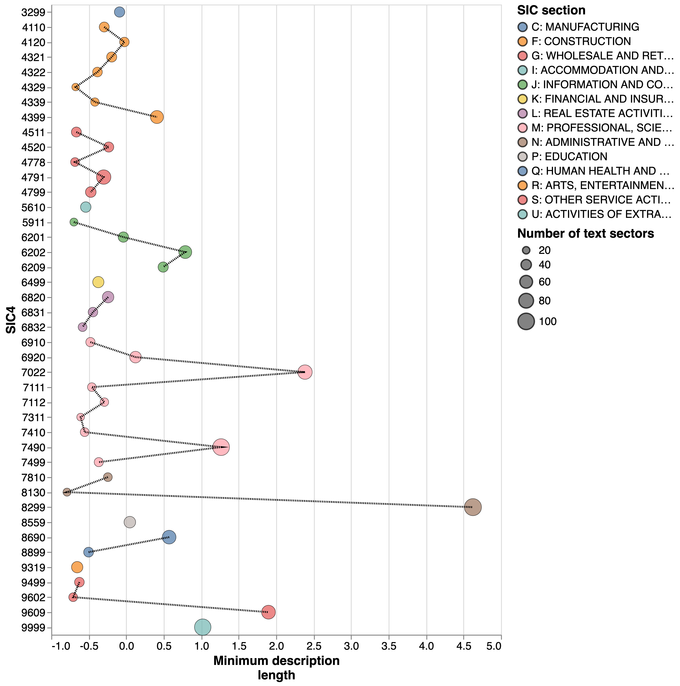
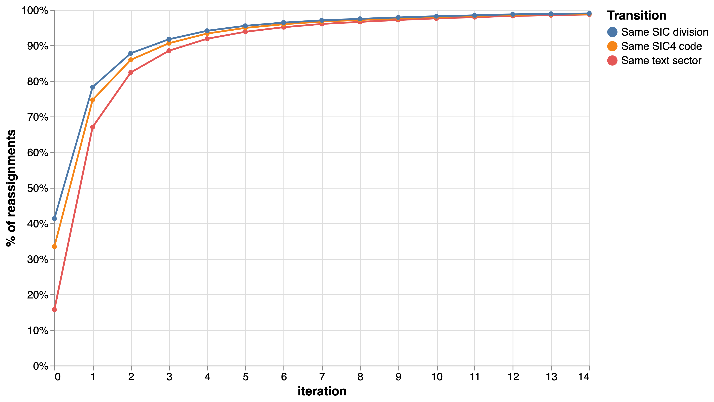
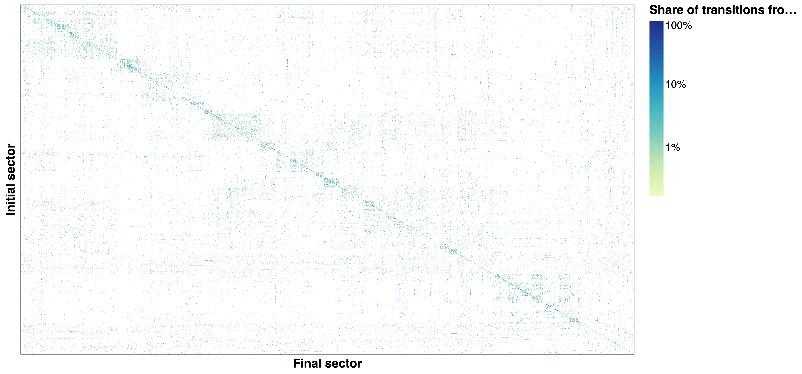
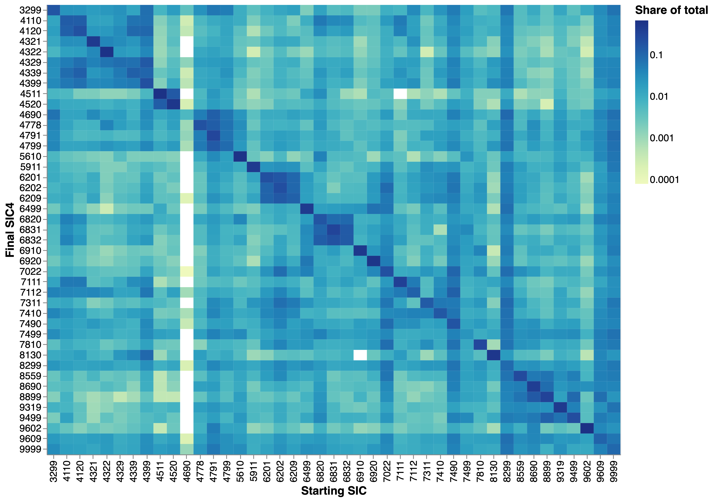
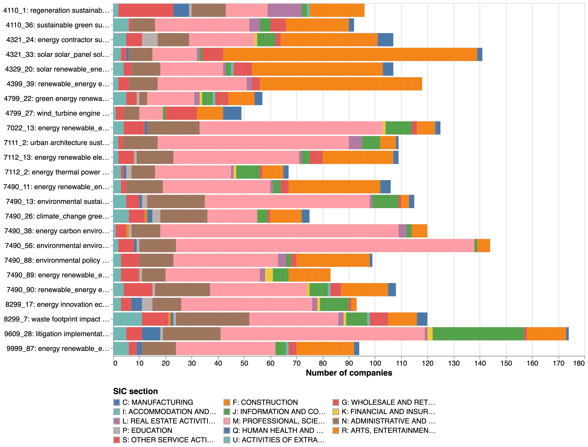
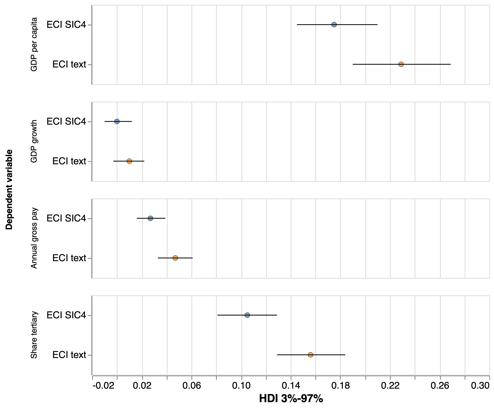
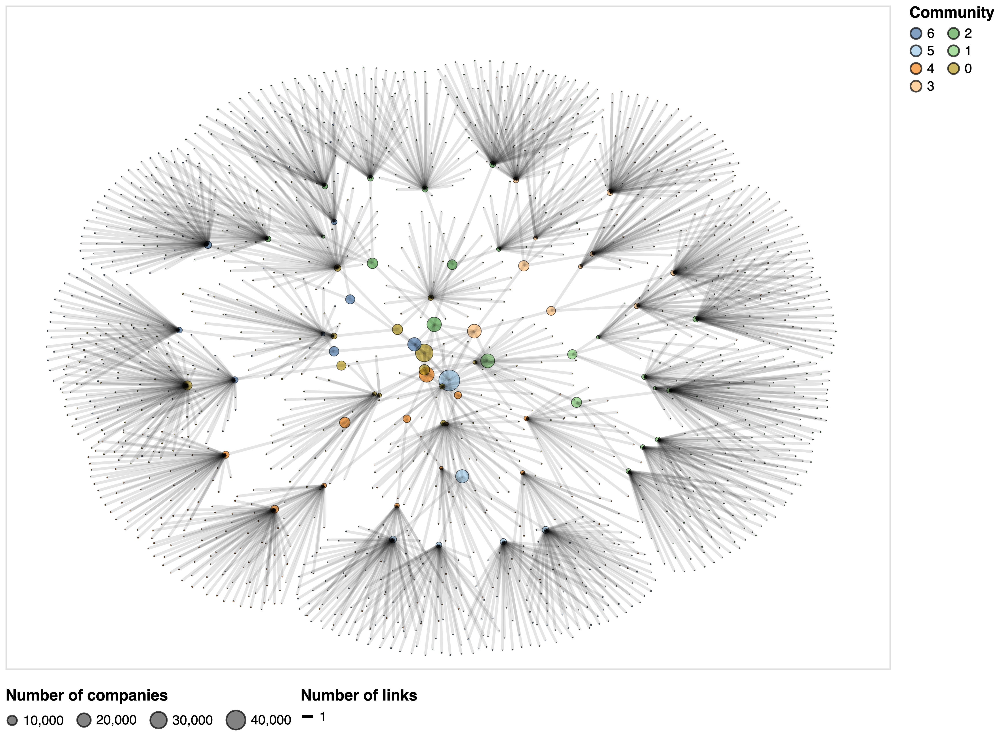

# Pilot strategy to develop a bottom-up industrial taxonomy {#sec:taxonomy}

Sections 3 and 4 have provided empirical evidence of important limitations of the SIC-2007 taxonomy. They include a mismatch between business descriptions and codes for some SIC codes, a strong overlap between codes in different parts of the taxonomy, and a presence of semantically heterogeneous 'not elsewhere classified' codes that attract very different types of companies as well as some companies that could be classified in other sectors of the taxonomy.

In this section we pilot an approch to build a bottom-up taxonomy based on company descriptions that addresses some of these limitations. Here are some of its features:

1. It draws on the SIC-2007 taxonomy: instead of replacing SIC-2007 with a new structure, we start at a relatively low level of resolution (SIC-4) in the SIC-2007 hierarchy and seek to decompose those categories into more granular sectors through a network analysis that we detail below.^[We note that there is a five-digit SIC category below the four digit but this includes a small number of codes - 191 versus 650 in the SIC4 - that tend to add limited information to what is available at the higher level.] 
2. Its production is automated: The categories within the taxonomy are identified and named automatically with some manual tuning of specific parameter to increase the intepretability and relevance of outputs.
3. It can be used to tag companies with labels for multiple sectors: This helps overcome the rigidities of the SIC taxonomy by accommodating companies that operate in several industries. it also makes it possible to remove 'duplicate sectors' extracted from different SIC codes, and, potentially to reconstruct the hierarchy of the bottom-up industrial taxonomy through an agglomerative clustering of the network of sector co-occurrences in companies.

In order to pursue these goals, we build a complex pipeline that we describe in the rest of this section, presenting emerging findings as we go. Before doing that, we provide a high-level methodological narrative that summarises the conceptual model informing our approach and the steps we have taken to implement it (see [@fig:4_0]).

## Methodological narrative

{#fig:4_0}

We think of industrial sectors as latent constructs that 'generate' words which are distributed over company descriptions.^[We use the term 'word' loosely to include unigrams, bigrams, trigrams etc.] Our analytical challenge is to infer sectors from those word distributions in the Glass data. To do this, we implement a network-based topic modelling strategy that assumes that groups of words that regularly co-occur in company descriptions are manifestations of sectors. The approach we follow, which models co-occurrences of words in company descriptions and similarity of company descriptions based on the words that co-occurr in them symmetrically, allows us to cluster companies based on their text descriptions. We consider these clusters as proxies for industries, and refer to them as 'text sectors'. 

This clustering is initially implemented _inside_ 4-digit SIC codes for reasons of scalability, precision and granularity. The downside is that we will also misclassify companies that were originally in erroneous SIC4 code. To address this, we use the vector representation of companies created in Section 3 with the DistilBERT model to iteratively reassign companies to the text sectors _across the SIC taxonomy_ that they are semantically closest to. An added benefit of this reassignment is that we would expect uninformative / noisy text sectors to lose companies in favour of more informative ones. 

Having reassigned companies to their closest text sector, we label those text sectors with the most salient terms in their corpora, and perform some exploratory analyses of the results by:

* Examining the composition of SIC 7490, one of the highly heterogeneous 4-digit SIC codes we identified above.
* Examing "green economy" activities across the population of text sectors
* Benchmarking metrics of the economic complexity of local economies in the UK based on SIC4 and text sectors.

Our sector reassignment step also yields a list of the K-closest sectors to a company that can be used for multi-sector tagging and to build text-sector similarity networks which can be clustered hierarchically to build an industrial taxonomy - we conclude with an experimental visualisation of such a taxonomy.

## Text preprocessing {#sec:text}

We start our analysis with just over 340,000 business website descriptions that have been matched with Companies House with a high level of certainty (match score above 75). The dataset includes 611 SIC4 codes (99% of all SIC4s). We have also tokenised their descriptions, performed named entity recognition to identify tokens that represent locations, company names, times etc. and removed those, and estimated n-grams (i.e. combined pairs and triads of tokens that occur frequently in the corpus, such as `city` and `centre` into a single token `city_centre`).

## Topic modeling {#sec:tm}

We want to cluster companies within 4-digit SIC codes into a more granular set of categories. To do this, we will use `top-SBM`, the same topic modelling algorithm based on the stochastic blockmodel that we used in Section 4 during our analysis of SIC4 heterogeneity [@topSBM]. TopSBM identifies topics in the corpus by building a network of word cooccurrences in documents and partitioning it into the set of communities (topics) most likely to have generated the data. This same approach can be used to represent documents in a network connecting those documents that share words (topics). This approach is applied recursively to generate a hierarchy of topics (document clusters) in the data, which are identified automatically. Here, we will focus our analysis on the outputs of the document (company description) clustering, which we treat as 'seed text sectors' for subsequent stages of the analysis.

Our decision to perform the document clustering _inside_ 4-digit SICs has four reasons:

1. As noted in the introduction to the section, we are interested in adding an extra level of granularity to the existing SIC taxonomy. Using the existing company classification as the first step for additional decompositions is an obvious strategy to achieve this.
2. The `topSBM` algorithm that we use has several advantages over alternative topic models and / or unsupervised machine learning approaches (e.g. clustering) that we could use to segment documents but it has the downside that it is harder to scale to larger corpora. By decomposing the corpus into a smaller set of 4-digit SIC sub-corpora we are able to deploy `topSBM` more efficiently.
3. Even though, as noted before, 4-digit SIC codes are noisy, our prior is that they still contain useful information for classifying companies into sectors. In particular, we would assume that companies in the same 4-digit SIC code will interpret words in similar ways, reducing the scope for semantic ambiguity that may introduce noise into our topic modeling if we performed it at the level of the whole corpus (for example, the term "network" will have different meanings in telecommunications, professional services and health-related SIC codes - if we implement our topic model in a corpus that incorporates all these sectors, network may be classified into an uninformative topic comprising the disparate terms it co-occurs with in each of them). 
4. Performing our analysis inside 4-digit SIC codes increases the granularity of the decomposition we are able to perform and reduces the risk that particular sectors dominate the clustering.

This approach is not without limitations - we highlight them and how we have addressed them in [@sec:reass].

We focus our topic modelling on 43 4-digit SIC codes with more than 2,000 companies comprising just over 192,000 companies. The topic model and company description clustering yields 1,884 text sectors. In [@fig:4_1] we present, for each of the SICs where we have clustered company descriptions, the number of text sectors extracted (size of the circles) and the minimum description length of the topic model trained in the corpus (a measure of the amount of information required to describe the corpus, providing an indicator of the goodness of fit of the topic model). 

{#fig:4_1}

We note that "Not Elsewhere Classified" SIC codes such as 8299 (Other business support service activities), 9609 (Other personal service activities) and 7490 (Other professional, scientific and technical activities) yield a large number of sectors and require more information to be described by the model, consistent with the idea that they are particularly fruitful sites for additional sector decomposition. Other sectors with large text sector populations and minimum description lengths include wide-ranging activities such as 7022 ("Business and other management consultancy activities") and 6022 ("Computer consultancy activities"). On the other hand, some of the sectors that yield few communities and are easy to describe by our topic models include 4329 ("Other construction installation"), 5911 ("Motion picture, video and television programme production activities") or 9602 ("Hairdressing and other beauty treatment") - these are arguably narrower sectors with much more informative SIC descriptions where we would expect to find a more homogeneous set of companies.

## Sector reassignment {#sec:reass}

The main downside of our clustering strategy is its restrictiveness: companies are clustered in groups inside 4-digit SIC codes. This means that a company that had been initially misclassified in a SIC code will be misclassified in a text sector (although we note that if companies from an industry are _systematically misclassified_ into a 4-digit SIC, our analysis may be able to identify them as a cluster within that SIC). In addition to this, companies in new industries for which there is not currently a SIC code will be scattered across text sectors in different SICs (e.g. in assorted "not elsewhere sectors") instead of being clustered together.

In order to address this, we implement a recursive sector reassignment step that draws on the vector representations of company descriptions that we obtained in section 3. This involves the following steps:

1. We calculate, for each of the text sectors in our data, a semantic centroid which is the mean of the vector representations of all the companies assigned to that text sector initially. One way to think about it is as the 'signature' or semantic summary of that text sector.
2. We calculate, for all companies in our data, their L1 (Manhattan) distance to each of those centroids. We do this efficiently using FAISS, a tool for rapid similarity search with high-dimensional vectors [@johnson2019billion].
3. We reassign each company to the text sector that it is closest to
4. We repeat steps 1-3 over 14 iterations.

[@fig:4_2] shows the share of companies changing text sector / SIC code (in other words, being reassigned from a text sector belonging to one SIC to a text sector belonging to another) or changing SIC division (i.e. 2-digit SIC code). After an initial stage of turbulence where less than 20% of companies are reassigned to their original text sector (justifying the adoption of this strategy), we see the assignments stabilise. By our last iteration a negligible number of companies are still being reassigned between text sectors. 

{#fig:4_2}

In [@fig:4_3; @fig:4_4] we present the origin and destination of sector transitions during the reassignment procedure, both in terms of individual text sectors and of the 4-digit SIC codes for text sectors. In both cases we see more activity in and around the diagonal, consistent with the idea that in a majority of cases companies stayed in their original text sector / SIC code. This suggests that the original clustering procedure generated many informative and robust clusters. At the same time, we see substantial transition levels between sectors outside the diagonal. For example, 10% of companies initially in text sectors within SIC4 8130 (Landscape Service activities) transition to SIC4 4399 (Other contruction activities). 7% of companies initially in text sectors belonging to SIC 6499 (Other financial service sector activities) transition to text sectors in SIC 6920 (Accounting and book-keeping). We also note substantial company flows involving "other" and "not elsewhere classified" text sectors.

{#fig:4_3}

{#fig:4_4}

What happens to "low quality" text sectors during the reassignment process? Our prior is that fuzzy and imprecise text sectors might lose companies to more accurate ones (e.g. because their centroid is, on average, further away from the vector representations of companies in the sector). We explore this hypothesis by comparing, for each text sector, its reassignment ratio (number of companies 'won' over number of companies 'lost' during the reassignment process) with its heterogeneity, which we measure as the average distance of a vector representation of each company in the text sector to its centroid. If our prior is correct, we would expect more heterogeneous text sectors to lose companies and more homogeneous text sectors to win companies. 

We present the results in [@fig:4_5]. Our analysis reveals a weak negative correlation between text sector heterogeneity and its reassignment ratio (Spearman $\rho = -0.31$), consistent with what we expected, and suggesting that our reassignment process somewhat penalises lower quality, less consistent sectors. We note that services text sectors (yellow and blue circles tend to more heterogeneous than manufacturing and construction, perhaps suggesting additional scope for decomposition into even more granular text sectors).

{#fig:4_5}

## Postprocessing

Having reassigned companies between text sectors, we proceed to name them by concatenating all company descriptions inside each text sector and identifying the most salient (highest term-frequency inverse-document-frequency (TF-IDF)) words in them. 

We present twenty randomly drawn examples in [@tbl:energy_ex]. These examples suggest that our approach is identifying meaningful sectors in previously uninformative categories (e.g. children related product and services in SIC 9999 (Unclassifiable) or vaping products in 4778 (other retail activities)) and decomposing aggregated sectors into more finely grained activities that might be of interest (e.g corporate social responsibility activities within management consultancy, digital and social media marketing in Specialised Design Activities).

\small
| SIC4                                                                                   |   Text sector ID | salient_terms                                                                                                                         |
|:---------------------------------------------------------------------------------------|:--------------------------------:|:--------------------------------------------------------------------------------------------------------------------------------------|
| 9999: Unclassifiable                                                                   |                0 | child baby toy parent kid school session activity bedroom childcare                                                                   |
| 9999: Unclassifiable                                                                   |               82 | repair physiotherapy removal accident_repair refurbish wheel refrigeration mot_testing mezzanine_floor machine_tool                   |
| 6202: Computer consultancy activities                                                  |               45 | software software_development platform application mobile integration cloud integrate open_source consultancy                         |
| 4778: Other retail sale of new goods in specialised stores                             |               16 | e_liquid flavour vape nut liquid bottle juice price fresh accessory                                                                   |
| 4791: Retail sale via mail order houses or via Internet                                |               56 | garden plant gardening basket seed vegetable flower grower food nursery                                                               |
| 6201: Computer programming activities                                                  |                6 | tech love innovation digital positively_impact idea passionate gaming geek thing                                                      |
| 4799: Other retail sale not in stores, stalls or markets                               |               28 | collector item auction memorabilia watch stock rare antique collection gun                                                            |
| 8899: Other social work activities without accommodation n.e.c.                        |                4 | activity centre child club play volunteer resident young_people school artist                                                         |
| 4399: Other specialised construction activities n.e.c.                                 |               54 | pickup contractor engineer repair contract roller_shutter maintenance garage maintain domestic_commercial                             |
| 7410: Specialised design activities                                                    |                0 | collection print interior contemporary textile colour art rug homeware fabric                                                         |
| 8690: Other human health activities                                                    |               16 | art young_people child_young mental_health tape counselling child activity self_esteem creative                                       |
| 9499: Activities of other membership organisations n.e.c.                              |               10 | tile grant closure committee trustees adam canal registered_charity bowl form                                                         |
| 7022: Business and other management consultancy activities                             |                4 | corporate_responsibility corporate_social sustainability responsibility employee corporate_governance impact stakeholder activity csr |
| 3299: Other manufacturing n.e.c.                                                       |                7 | packaging print printing label design_print large_format colour marquee printer clothing                                              |
| 7410: Specialised design activities                                                    |               23 | marketing website creative strategy social_medium web_design digital_marketing campaign success digital                               |
| 4520: Maintenance and repair of motor vehicles                                         |                0 | garage repair diagnostic_equipment diagnostic ecu workshop fault car_servicing mot make_model                                         |
| 6499: Other financial service activities, except insurance and pension funding, n.e.c. |               34 | financial finance growth platform bank software lack marketing success economy                                                        |
| 8690: Other human health activities                                                    |               68 | foot treatment clinic patient surgery nail treat condition health pain_free                                                           |
| 4321: Electrical installation                                                          |               24 | energy maintenance network contractor sustainable safety engineering engineer cost_effective utility                                  |
| 8690: Other human health activities                                                    |               14 | charity donation donate raise_money fund fundraising volunteer hospice raise_fund school                                              |

: Randomly selected example text sectors {#tbl:energy_ex}

\normalsize

## Exploratory analyses

This subsection explores in further detail some of the opportunities opened up by our prototype text-based industrial classification.

### Unpacking SIC 7490

We begin with an exploration or the results of our sector decomposition, reassignment and labelling in SIC 7490 ("Other professional, scientific and technical activities N.E.C."). This is a SIC code which, has we have showed in previous sections, has high levels of heterogeneity. We might also expect to find inside it knowledge intensive companies with high growth potential that operate in 'new sectors' not yet captured by the lagging SIC taxonomy. 

[@fig:4_6] presents the distribution of companies over text sectors in this SIC. The colours of the bars represent the original SIC sections for text sectors before reassignment. Our results highlight the heterogeneity of sectors contained in 7490, ranging from `7490_29` (coaching) to `7490_50` (mediation), `7490_90` (renewable energies) or `7490_52` (copywriting). This is also reflected in the section origins for companies in text sectors such as `7490_66` (construction) or `7490_57` (health). We also note the presence of some noisy / hard to interpret text sectors in the data such as `7490_5`, which seems to capture companies that mention the positions and names of individual employees in their website descriptions. This points at the need to implement strategies to remove spurious text sectors in future iterations of the analysis.

{#fig:4_6}

### Green economy text sectors in the Glass data

We can also identify text sectors in policy-relevant areas more effectively than in the SIC taxonomy. As an illustration, we have selected all text sectors that mention three or more terms related to the green economy such as "environmental", "renewable", "solar", "sustainability", "energy", "emission", "sustainable", "green_energy" in their labels. We identify 25 sectors comprising 2,508 firms. 

We present their distribution by text sector and source sector in [@fig:4_7]. The chart illustrates the range of economic activities related to the green economy that we are able to identify in our data, ranging from sustainable housing (`4110_1`) to solar panels (`4321_23`) and wind turbines (`4799_27`), thermal energy (`7112_2`), waste management (`8299_7`) and environmental litigation (`9609_28`). 

There is also some repetition in the labels for the sectors we have identified. This could be an artifact of our strategy to label sectors (i.e. we extract each text sector's salient terms compared to all other text sectors in the corpus, potentially creating a situation where several text sectors share the same terms in their labels). It also suggests that we might be able to merge similar text sectors extracted from different SIC codes, an idea we explore further below.

{#fig:4_7}

### Economic complexity benchmarking

Here, we use our text-sector classification to produce estimates of economic complexity ("Economic Complexity Indices" or "ECI") at the local authority level in the UK and estimate the association between these indices and other measures of local economic performance and knowledge intensity such as GDP per capita, GDP growth, median annual earnings and share of the workforce with tertiary education.^[We extract these secondary data from ONS regional accounts data, the Annual Survey of Hours and Earnings and the Annual Population Survey.] We then compare the strength of those associations with an ECI based on 4-digit SIC codes. 

This analysis is motivated by strong evidence of a link between ECI - a composite indicator capturing the relative uniqueness of the productive capabilities in a location - and other metrics of local economic performance [@hidalgo2009building; @bishop2019exploring]. If text sectors offer a more accurate representation of the productive capabilities in a location than  aggregated and -in some cases- uninformative SIC codes, then we would expect an ECI based on it to be more strongly associated with economic outcomes in a location. 

We explore this hypothesis using a Bayesian linear regression framework implemented in the `bambi` package [@capretto2020bambi; @gelman2020regression] where we regress our measures of economic performance based on secondary data on ECI indices calculated with text sectors and 4-digit SIC codes controlling for local population (logged) and a local authority's NUTS-1 region to respectively control for potential economies of scale and systematic differences in the economic performance of different UK regions. We present the 94% high density intervals in [@fig:4_8]. 

{#fig:4_8}

All local economic performance and knowledge intensity indices show a stronger association with the text-based ECI than with the SIC-based ECI. When we compare pairs of models using leave-one-out cross-validation [@vehtari2017practical] we find that, in all cases, the models based on text-based ECI indices outperform the SIC-based ECIs. This supports the idea that our text-based sectors can help characterise the economic composition of a location (and perhaps its strengths and weaknesses) more accurately than the SIC alternative.

## A hierarchical taxonomy

We conclude our exploration of results by building a hierarchical industrial taxonomy based on the semantic similarity between text sectors. In order to do this, we extract the five closest sectors to each company at the end of the sector reassignment strategy described before and use it to build a text sector co-occurrence network connecting those text sectors that are closer to each other.^[The closest sector to each company would be the one it was classified into at the end of our sector reassignment procedure.] 

Having done this, we decompose the network into a hierarchical set of densely-connected communities using a stochastic block-model [@peixoto2017nonparametric] - this results in a network where an initial layer of 1,884 text sectors is connected to progressively more aggregated communities. We display a network with three levels of the hierarchy above that lowest (text sector) level.

{#fig:4_9}

At this point, this taxonomy is just the experimental output of one strategy to transform a 'flat' collection of text sectors into a hierarchy that can be explored and aggregated at various levels of resolution. A future step in the analysis will be to analyse its interpretability, its comparability with the SIC taxonomy and the role that it can play in deduplicating similar text sectors extracted from different parts of the SIC taxonomy. 

## Conclusions and next steps

The pipeline we have developed yields a highly granular collection of text sectors that can be used to decompose noisy and uninformative SIC codes, explore policy relevant industrial activities such as those related to the 'green economy', and characterise the industrial composition of local economies more accurately than is possible with the SIC taxonomy. There are many other possibilities that we have not explored, such as for example using text sectors to proxy the presence of particular capabilities in a company e.g. the adoption of digital and data analytics technologies.

Our analysis is, however, not without limitations that we will seek to address in future work.

1. Our pipeline only includes 43 4-digit SIC codes. Future analysis should seek to improve our coverage of sectors in the Glass data. 
2. The text sector extraction procedure yields some noisy sectors based on irrelevant content in company descriptions. Going forward, we will explore avenues to reduce their presence through text-preprocessing (e.g. removing potentially irrelevant text from company descriptions before training our topic models) or post-processing (e.g. analysing various sector features such as their homogeneity and removing them before the sector reassignment stage).
3. Our procedure to reasign companies to text sectors is binary: each company is assigned to its closest sector regardless of its position within the distribution of distances to that sector. It would be preferrable if this procedure generated a measure of confidence in the assignment which could then use to test the robustness of our results to changes in similarity thresholds.
4. The sector labelling does not yield sufficiently distinctive text sector names. This could be addressed by calculating TF-IDF scores for a sector's corpus compared to similar text sectors (for example those extracted from the same SIC code) instead of the whole corpus.
5. We noted the presence of duplicated text sectors extracted from different SIC codes in the data. We will explore strategies to merge duplicated text sectors, for example, by implementing an agglomerative clustering step along the lines of what we have done to build the prototype hierarchical taxonomy.

